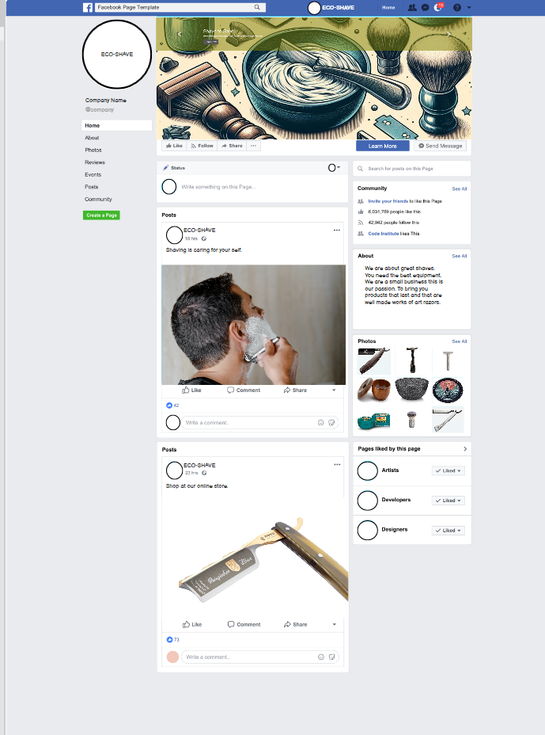

# Table of Contents

- [Objective](#objective)
- [Site User Goal](#site-user-goal)
- [Site Owners Goal](#site-owners-goal)
- [Business Model](#business-model)
  - [ DE and SE Shaving – The Philosophy](#de-se-shaving--the-philosophy)
  - [Marketing Strategy](#marketing-strategy)
  - [Future Marketing Ideas](#future-marketing-ideas)
  - [SEO](#seo)
  - [Google Search Console](#google-search-console)  
- [User Experience (UX)](#user-experience-ux)
  - [User Stories](#user-stories)
- [Design](#design)
  - [Colour Scheme](#colour-scheme)
  - [Skeleton](#skeleton)
  - [#### Product SKU Format](#product-sku-format)
  - [Wireframes](#wireframes)
  - [Flowchart](#flowchart)
  - [Visual Effects](#visual-effects)
- [Features](#features)
  - [Visual Effects](#visual-effects)
  - [Home Page](#home-page)
  - [Product Page](#product-page)
  - [Product Detail Page](#product-detail-page)
  - [Checkout Page & Success Checkout Page ](#checkout-page-&-success-checkout-page)
  - [About Page](#about-us-page)
  - [Contact Page](#contact-page)
  - [Account Login](#account-login)
  - [Register](#register)
  - [Profile](#profile)
  - [Logout](#logout)
  - [Future Features](#future-features)
  - [Technolgies used](#technolgies-used)
- [Agile Methodology](#agile-methodology)
  - [Database](#database)
- [Testing](#testing)
  - [Responsive Layout and Design](#responsive-layout-and-design)
  - [Testing User Stories](#testing-user-stories)
  - [Lighthouse](#lighthouse)
  - [HTML Validation](#html-validation)
  - [CSS Validation](#css-validation)
  - [Manual Testing](#manual-testing)
  - [Frontend](#frontend)
  - [Backend Admin Panel](#backend-admin-panel)
  - [Fixed Bugs](#fixed-bugs)
  - [Unfixed Bugs](#unfixed-bugs)
- [Creating the Django app](#creating-the-django-app)
  - [Deployment of This Project](#deployment-of-this-project)
  - [Final Deployment](#final-deployment)
  - [Forking This Project](#forking-this-project)
  - [Cloning This Project](#cloning-this-project)
- [Credits](#credits)
  - [Acknowledgements](#acknowledgements)


I decided to try building a shaving website because I am interested in this way of shaving.
The objective for me was to create an e-commerce site that sells shaving products.
Try my hand at an e-commerce layout using the Django Framework, Python, JavaScript, CSS, and HTML.


## Site User Goal

This website sells shaving products that will transform your shave and last for a long time.
While in a small way educating on the benefits of shaving with de razors and single-edge razors. 


## Site Owners Goal

The goal is to sell these products online through a Django app that uses secure payment methods like Stripe.

**Project Objectives:**

# Business Model 

This is a company that sells shaving products for DE double-edge blades or single-edge blades and accessories.
The razors can be used for a lifetime even passed on to other generations and still customers can get the best shaves.
So in actual fact each time a customer uses these products they are helping the environment and saving at the same time.

## DE and SE Shaving – The Philosophy

* The shaving razors are the best in my opinion. After you go through a small learning curve you get the best shaves.
* It's a customizable shave where you can change different accessories such as blades and soaps even your shaving routine plays a role, endless way of customizing your shave.
* Why not turn an everyday shave into a hobby and something to look forward to doing every day?
* DE double edge is newer than the SE single edge razors that date as far back as the Egyptians even further probably. 
* It is a product that can last and the longer it lasts the more you are saving, I will say it's a tool that keeps giving.
* It helps the environment by using a product longer and leaving no waste when discarded. Mostly they are given to another generation.


## Marketing Strategy

### Target Audience
- * The focus would be on people who want products that are sustainable, cost-saving, and bring everyday value.
- * The business would look for online marketing options such as Facebook which has a large market following.

### Marketing used 

* On this site we used email marketing from an application called Mailchimp. 
* A mockup of a Facebook page for social media marketing that could be implemented in the future should the site go live 
* And tried to use certain SEO search engine optimization strategies.
* Content marketing was used in this just to educate the users of the site of the benefits of using these products in the FAQ and landing page.


### Facebook 

Social Media marketing is a great way to get your product across to online as it has a large following.
It has a huge potential for small businesses.
This tool helps the eco-shave team as they can interact directly with the customers or potential customers.
This can boost the brand and awareness of our business.


<details>
<summary>Facebook</summary>

* I created a mockup of the Facebook page here using the Balsamiq mockups provided by LMS.
 
 <br>

* I had some problems setting up an account I have provided the error image below.
 I tried registering another account but it kept giving me this error.

* I had some problems setting up an account I have provided the error image below.
  I tried registering another account but it kept giving me this error.

  <br>

</details>

### Budget 

* Since this is a small online shop that is not live yet, free marketing strategies are be used.


### SEO

* Using Search Engine Optimization (seo) is a science and when done correctly you should see traffic diverted to the site.

## Future Marketing Ideas
* 

[Back to Table of Contents](#table-of-contents)

# User Experience UX

## User Stories

User stories can be viewed here on the project [kanban board ](https://github.com/users/Marceillo/projects/10)

| EPIC                                   | ID  | Priority     | User Story                                                                                     |
| :------------------------------------- | --  | :----------- | :--------------------------------------------------------------------------------------------- |
| **E-commerce Integration**             | 1.1 | Must-Have    | As a user, I want to add products to a shopping cart and proceed to check out, so I can easily make purchases on the site. |
|                                       | 1.2 | Must-Have    | As a user, I want to receive confirmation of my purchase via email and on-screen notifications, so I can verify my order. |
|                                       | 1.3 | Should-Have  | As a user, I want a streamlined checkout process, so I can complete my purchases efficiently.  |
| **User Experience Design**            | 2.1 | Must-Have    | As a user, I want an accessible and intuitive website, so I can navigate and interact with the content seamlessly. |
|                                       | 2.2 | Must-Have    | As a user, I want a mobile-responsive design, so I can access the website on different devices. |
|                                       | 2.3 | Should-Have  | As a user, I want to edit and view my profile information, so I can keep my account details up-to-date. |
|                                       | 2.4 | Should-Have  | As a user, I want to create and manage a wishlist within my profile modal, so I can save products for future consideration. |
| **Search Engine Optimization**         | 3.1 | Must-Have    | As a user, I want to find products quickly using search functionality, so I can locate items efficiently. |
|                                       | 3.2 | Should-Have  | As a user, I want a helpful 404 error page with navigation options, so I can find my way back to the main site if needed. |
| **Authentication and Authorization**   | 4.1 | Must-Have    | As a user, I want to register and log in securely to access my account information.           |
|                                       | 4.2 | Must-Have    | As an admin, I want to manage user roles effectively, so I can control access levels based on user roles. |
|                                       | 4.3 | Should-Have  | As a user, I want to see my login status clearly on every page.                               |
| **Marketing and Brand Reach**         | 5.1 | Must-Have    | As a user, I want to subscribe to newsletters for updates and promotions.                     |
|                                       | 5.2 | Should-Have  | As a user, I want to share products on social media easily to recommend them to friends.     |
| **E-commerce Fundamentals**            | 6.1 | Must-Have    | As a business owner, I want to document the e-commerce model clearly for outlining the application’s purpose and user value. |
| **Customer Support and Information Access** | 7.1 | Must-Have    | As a user, I want to submit a contact form so that I can easily reach out for support or inquiries.   |
|                                       | 7.2 | Must-Have    | As a user, I want to view frequently asked questions in a modal so that I can find quick answers without leaving the About Page.   |
|                                       | 7.3 | Should-Have  | As a user, I want the contact form and FAQ modal to be mobile-responsive so that I can access them on any device.   |
[Back to Table of Contents](#table-of-contents)


# Design

## Colours

* I used colors to match the background which is a moving mp4, more about that below in visual experience.

 <br>

### Colour Scheme

* Used a [Coolors web site](https://coolors.co/palettes/trendin) to search for colors that match.

[Back to Table of Contents](#table-of-contents)

## Typography

* The Roboto font is the main font, and Lato is the secondary font used for the whole project.

[Back to Table of Contents](#table-of-contents)

### Imagery

#### Product SKU Format

* This is a format for each product will have differant sku so that can be used now and in future features.
* In the future of this bussiness when stock becomes larger it can be used to help with stock management.
* - Invintory tracking 
* - Streamlining Point of sale (POS) Operations 
* It can be used for sales data analysis and other applications.


| SKU              | Product Type                   |
|------------------|--------------------------------|
| SR-001-STR-2024  | Straight Razor 2               |
| SR-002-RAZ-2024  | Razor                          |
| SR-003-BRS-2024  | Brush                          |
| SR-004-SAP-2024  | Soap                           |
| SR-005-CRE-2024  | Cream                          |
| SR-006-BLA-2024  | Blade                          |
| SR-007-SAF-2024  | Safety Razor 3                 |
| SR-008-PRE-2024  | Pre-shave                      |
| SR-009-BAG-2024  | Bag                            |
| SR-010-BRT-2024  | Brush Restorer Tool            |
| SR-011-SHM-2024  | Shaving Mug                    |
| SR-012-MUG-2024  | Mug                            |
| SR-013-RUB-2024  | Rub                            |
| SR-014-LTH-2024  | Leather                        |
| SR-015-TOW-2024  | Towel                          |
| SR-016-FLA-2024  | Flannel                        |
| SR-017-PAD-2024  | Pad                            |
| SR-018-KIT-2024  | Kit                            |
| SR-019-GEL-2024  | Gel                            |
| SR-020-WAX-2024  | Wax                            |
| SR-021-FIN-2024  | Finish                         |
| SR-022-COM-2024  | Comb                           |
| SR-023-SCR-2024  | Scraper                        |
| SR-024-RAS-2024  | Razor Stand                    |
| SR-025-HOL-2024  | Holder                         |
| SR-026-SLI-2024  | Slitter                        |
| SR-027-PEN-2024  | Pen                            |
| SR-028-CAP-2024  | Cap                            |
| SR-029-DIS-2024  | Dispenser                      |
| SR-030-BLK-2024  | Black Razor                    |

# Skeleton

## Wireframes

* The wireframes for mobile and desktop and used [Balsamiq](https://balsamiq.com/)

<br>
<details>
  <summary>Wire Frames</summary>
  <h4>Home page</h4>
  <br>
  <h4>Home after signed in page</h4>
  <br>
  <h4>Create Blog page link only when logged in</h4>
  <br>
  <h4>My Blog page link only when logged in</h4>
  <br>
  <h4>Profile page link only when logged in</h4>
  <br>
  <h4>MY Profile edit page link only when logged in</h4>
  <br>
  <h4>About page</h4>
  <br>
  <h4>About contact page</h4>
  <br>
  <h4>Register page </h4>
  <br>
  <h4>Login</h4>
  <br>
  <h4>Signout</h4>
  <br>
</details>

<br>

## Initial ERD Diagram

<details>
<summary>My Intial ERD Diagram</summary>

* For the initial ERD diagram plan, I used [lucid chart](https://www.lucidchart.com/)
<br>
<br>

<br>
<br>
</details>

## Django ERD Diagram
<details>
<summary>Used code Django to get an ERD.dot file and convert it to ERD Diagram</summary>
Django has a built-in tool that can show you your ERD diagram.

### Reason 

* It is not always possible to start a project from scratch sometimes it may be the case that you need to work on someone else project.
* So this will give me as a developer an overview of the project from an ERD standpoint.

### Steps used
* Step 1 to using this is to install python3 -m pip install django-extensions.
* Step 2 would be to add the installed apps in settings.
* Step 3 would be to add it to the requirements file.
* Step 4 is to run the python manage.py graph_models -a --output erd.dot 
* Step 5 After this it will create an erd. dot file with all the application model data.
* Step 6 Put the data in this software to change to an image file much like the one I used below.

The red dot file converted to image [Graphviz online](https://dreampuf.github.io/GraphvizOnline/#digraph%20G%20%7B%0A%0A%20%20subgraph%20cluster_0%20%7B%0A%20%20%20%20style%3Dfilled%3B%0A%20%20%20%20color%3Dlightgrey%3B%0A%20%20%20%20node%20%5Bstyle%3Dfilled%2Ccolor%3Dwhite%5D%3B%0A%20%20%20%20a0%20-%3E%20a1%20-%3E%20a2%20-%3E%20a3%3B%0A%20%20%20%20label%20%3D%20%22process%20%231%22%3B%0A%20%20%7D%0A%0A%20%20subgraph%20cluster_1%20%7B%0A%20%20%20%20node%20%5Bstyle%3Dfilled%5D%3B%0A%20%20%20%20b0%20-%3E%20b1%20-%3E%20b2%20-%3E%20b3%3B%0A%20%20%20%20label%20%3D%20%22process%20%232%22%3B%0A%20%20%20%20color%3Dblue%0A%20%20%7D%0A%20%20start%20-%3E%20a0%3B%0A%20%20start%20-%3E%20b0%3B%0A%20%20a1%20-%3E%20b3%3B%0A%20%20b2%20-%3E%20a3%3B%0A%20%20a3%20-%3E%20a0%3B%0A%20%20a3%20-%3E%20end%3B%0A%20%20b3%20-%3E%20end%3B%0A%0A%20%20start%20%5Bshape%3DMdiamond%5D%3B%0A%20%20end%20%5Bshape%3DMsquare%5D%3B%0A%7D)
<br>
<br>
<br>

## Credit below for the above-detailed ERD diagram.

[YouTube link](https://www.youtube.com/watch?v=qzrE7cfc_3Q&t=357s)
[django-extensions](https://django-extensions.readthedocs.io/en/latest/graph_models.html)

</details>

## Visual Experience

* 

#### Positives

*

#### Negatives 

* 

[Back to Table of Contents](#table-of-contents)

## Features

### Home Page

* Styling : Used one of bootstrape [4.6 template example](https://getbootstrap.com/docs/4.6/examples/carousel/) example for the carousel and styled from there.  
* Image: I used a [Ai generatied image](https://www.bing.com/images/create?FORM=GENILP) as I could not find a image that matches.

<details>

<summary>Home Page Summary</summary>

<br>

#### Before login 

* 

 <br>


<br>

#### After login  

*

<br>


### Footer

* Has social website links to Facebook, X, and YouTube.

<br>


<br>

</details>

### Product Page 

* Feature :[django-star-ratings](https://django-star-ratings.readthedocs.io/en/latest/) this is a software install that handles the ratings this is differant to the LMS.
* Sort feature has been setup without dango star rating
* - Had a problem where django could not see certain fields in the star ratings generic setup will add this as future setup.
* Images used from these links: 
* - 
* - 

### Product Detail Page

* Feature : [Multiview feature](https://djangoguide.com/django-image-upload-specialization/django-multiple-image-upload/) from django that allows for one object to have multiple images .
* - The Multiview is a extra model as with admin CRUD function.  
* Feature :[django-star-ratings](https://django-star-ratings.readthedocs.io/en/latest/) this is a software install that handles the ratings this is differant to the LMS.
* - The Lms had rating system but this one has been setup differantly.

### Shoppping Bag Page

* Note: The bag app was really difficult to setup when not doing it exactly like the LMS.
* - Side note I had little support from tutoring team as they kept instructing me to make it similar to the LMS. 
* - Learning is about trying new things and making mistakes, I believe from this I learnt that variables should be consistant.
* - Problem 1: The adding of image and date to the bag app. Solution was had to redo the bag/views,context.py several times.
* - Problem 2: The remove button was not working as I was not consistently using strings for keys, after all the refactoring and print logs problem resolved.
* Styling : I used a [free template](https://bbbootstrap.com/snippets/bootstrap-ecommerce-shopping-cart-item-summary-44021562) and customised it to the bag app 

### Checkout Page & Success Checkout Page

* Note: This is a page to allow the user to fill out there personal details and delivery information.
* Bug fix: The Checkout success page was not showing up after confirming the form repaired views the problem was the element for java script was not in the  
  layout.   
* - Setup stripe as per the LMS the views have changed in the last years but still managed to create a account and setup.

### User Profile 

* The page for the profile shows the order history and the profile information.
* When you click on the profile information there is flip animation that for the user to update.
* Delete profile still to be implemented 

### Product Admin 

* I have django multiview feature this did not work with the widgets from django lms had to make a view changes.
* - Due to errors, I used the admin view with the inspect tool, to see how the admin handels delet and update images.
* - The used this information to implement in my view of this project. 


### About Page

<details>
<summary>About Page summary</summary>
<br>

* Note: This is a basic page with a contact form for users to get in contact.


<br>


<br>

#### Contact form 

* Note: This is a basic page with a contact form for users to get in contact.

<br>


<br>

</details> 

### Register Page

<details>

<summary>Register Page summary</summary>

<br>

* Note: Here the user can register an account for more features in order to have some CRUD functionality.
* The email address is optional for now as this is not yet live to the general public and some might not like that.
* If a user decides not to enter an email address and forget their password they will need to use the contact form so that the admin can reset this.

<br>


</details>

### Login page

<details>

<summary>Login and Logout Page summary</summary>

<br>

* Note: Here you can log in using the allauth tool in Django.
* Note: I added the forgot password feature here to give the users the ability to be independent. 
* However it is not 100 percent as certain mail servers block Django messages. 

<br>


#### Forgot Password

<br>

* When you click on the forgot password you will be prompted for your email address.

<br>


<br>

* If you did not add an email address as it is optional you can use the About contact form to get in contact.
* Once you enter your e-mail address you will see this screen as a user.

<br>


##### NOTE:

* The link will be sent to the IDE terminal and only to certain email service providers.
* The reason for this is that certain service providers block Django messages on the server side such as Gmail.
* This is not a live site and not in control of the SMTP server I have to accept this result.

###### Terminal link view 
<br>


<br>

###### Temporary email address view test from Heruko

* The way I tested this was to use a temporary [ temporary e-mail service provider](https://temp-mail.org/).
* Created a user account with the temp email service provider and tested this.

<br>


<br>

</details>

### After login: Profile Page CRUD 

<details>

<summary>Profile Page summary</summary>

#### Profile page view 

* When you click on the Profile icon with your registered name it will show you your profile data.
* Here you will have CRUD functionality.
* You will be able to change your password.
* Delete Your profile.
* Edit your Profile Image as there is a default image, as well as personal details including kayaking skills.     

<br>


<br>

#### Profile Edit 

<br>


<br>

#### Profile password Change 


<br>

#### Profile Delete

<br>


<br>

</details>


</details>

### Confirmation Messages 
<details>
<summary>Confirmation messages</summary>

* There are success confirmation message and error messages 
* There is Java Script and mondal code inspired by the LMS.

* Logging in and out
* In the Comments features
* In the post features
* When registering a new account
* In the Profile features  
* Favorite or unfavorite


</details>

### Future Features

* To sort using the django star rating 
* - This will be added a as future feature as the way it is currently setup using the generic build I will need to change the way the data base interacts with the software.
* I did not inlcude Pagination  the amount of products per page so will be the next future feature.  

[Back to Table of Contents](#table-of-contents)

## Technolgies Used

### Dependencies
<details>
<summary>Dependencies used summary</summary>

This is simple description of the key dependencies used in the app.

- **asgiref==3.8.1**: A library that provides utilities for ASGI (Asynchronous Server Gateway Interface) applications.

- **click==8.1.7**: A package for creating command-line interfaces (CLI) in Python.

- **cloudinary==1.40.0**: A library for integrating Cloudinary's image and video management services in the application.

- **colorama==0.4.6**: A library that allows for cross-platform colored terminal text in Python.

- **crispy-bootstrap5==2024.2**: A Django application that provides Bootstrap 5 support for crispy forms.

- **cssbeautifier==1.15.1**: A tool for formatting and beautifying CSS code.

- **dj-database-url==0.5.0**: A utility for parsing database URLs and configuring Django's database settings from environment variables.

- **dj3-cloudinary-storage==0.0.6**: A Django storage backend for Cloudinary.

- **Django==4.2.13**: The primary web framework for building web applications in Python.

- **django-allauth==0.57.2**: A comprehensive authentication package for Django that supports authentication and account management.

- **django-crispy-forms==2.2**: A Django application that helps to manage and render forms with a clean and customizable layout.

- **django-extensions==3.2.3**: A collection of custom extensions for Django.

- **EditorConfig==0.12.4**: A plugin that helps maintain consistent coding styles across different editors and IDEs by using a `.editorconfig` file.

- **gunicorn==20.1.0**: A Python WSGI HTTP server for UNIX, used to serve your Django application in a production environment.

- **html-tag-names==0.1.2**: A library that provides a list of HTML tag names.

- **html-void-elements==0.1.0**: A utility that defines void elements in HTML.

- **jsbeautifier==1.15.1**: A JavaScript beautifier that formats and beautifies JavaScript code for improved readability.

- **oauthlib==3.2.2**: A generic, spec-compliant implementation of the OAuth request-signing logic for Python, facilitating OAuth 1 and OAuth 2 support.

- **pathspec==0.12.1**: A library that provides a way to specify file patterns for matching files in a directory.

- **psycopg2==2.9.9**: A PostgreSQL adapter for Python, allowing Django to interact with PostgreSQL databases.

- **PyJWT==2.8.0**: A Python library for encoding and decoding JSON Web Tokens (JWT), used for secure authentication and information exchange.

- **python-dotenv==1.0.1**: A library that reads key-value pairs from a `.env` file and adds them to the environment variables.

- **python3-openid==3.2.0**: A library for OpenID authentication in Python, enabling users to log in using their OpenID credentials.

- **regex==2024.7.24**: An alternative to Python's built-in `re` module, providing additional functionality for regular expressions.

- **requests-oauthlib==2.0.0**: A library that provides OAuth support for the popular `requests` library, making it easier to work with OAuth-protected APIs.

- **sqlparse==0.5.0**: A non-validating SQL parser for Python, useful for formatting and analyzing SQL queries.

- **tqdm==4.66.5**: A library for creating progress bars in Python.

- **whitenoise==6.5.0**: A middleware for serving static files in Django applications, simplifying static file management in production environments.

</details>

### Tools Used

[GitHub](https://github.com/) - used for hosting the source code of the program<br>
[Heroku](https://dashboard.heroku.com/) - used for deploying the project<br>
[Favicon.io](https://favicon.io/) - used for generating the website favicon<br>
[Font Awesome](https://fontawesome.com/) - for creating atractive UX with icons<br>
[Bootstrap5](https://getbootstrap.com/) - for adding predefined styled elements and creating responsiveness<br>
[Google Fonts](https://fonts.google.com/) - for typography<br>
[JsHint](https://jshint.com/) - used for validating the javascript code<br>
[PEP8 Validator](http://pep8online.com/) - used for validating the python code<br>
[HTML - W3C HTML Validator](https://validator.w3.org/#validate_by_uri+with_options) - used for validating the HTML<br>
[CSS - Jigsaw CSS Validator](https://jigsaw.w3.org/css-validator/#validate_by_uri) - used for validating the CSS<br>
[GraphvizOnline](https://dreampuf.github.io/GraphvizOnline/#digraaph%20G%20%7B%0A%0A%20%20subgraph%20cluster_0%20%7B%0A%20%20%20%20style%3Dfilled%3B%0A%20%20%20%20color%3Dlightgrey%3B%0A%20%20%20%20node%20%5Bstyle%3Dfilled%2Ccolor%3Dwhite%5D%3B%0A%20%20%20%20a0%20-%3E%20a1%20-%3E%20a2%20-%3E%20a3%3B%0A%20%20%20%20label%20%3D%20%22process%20%231%22%3B%0A%20%20%7D%0A%0A%20%20subgraph%20cluster_1%20%7B%0A%20%20%20%20node%20%5Bstyle%3Dfilled%5D%3B%0A%20%20%20%20b0%20-%3E%20b1%20-%3E%20b2%20-%3E%20b3%3B%0A%20%20%20%20label%20%3D%20%22process%20%232%22%3B%0A%20%20%20%20color%3Dblue%0A%20%20%7D%0A%20%20start%20-%3E%20a0%3B%0A%20%20start%20-%3E%20b0%3B%0A%20%20a1%20-%3E%20b3%3B%0A%20%20b2%20-%3E%20a3%3B%0A%20%20a3%20-%3E%20a0%3B%0A%20%20a3%20-%3E%20end%3B%0A%20%20b3%20-%3E%20end%3B%0A%0A%20%20start%20%5Bshape%3DMdiamond%5D%3B%0A%20%20end%20%5Bshape%3DMsquare%5D%3B%0A%7D) - To take erd. dot file and convert to a graph<br>
LightHouse in the browser- for testing performance<br>
[Cloudinary](https://cloudinary.com/users/login) - to handel the image storage.<br>
[CI database](https://dbs.ci-dbs.net/)
[temp-mail](https://temp-mail.org/en/)
[grammarly](https://app.grammarly.com/) spell checker for this readme.

[Back to Table of Contents](#table-of-contents)


## Database

The project uses the PostgreSQL database for storing the data.

## Agile Methodology
This project was developed using the Agile methodology.<br>
All epics and user stories implementation progress was registered using [Github](https://github.com/users/Marceillo/projects/8). As the user stories were accomplished, they were moved in the Kanban Board from **Epic**,**User stories**, **No Status**, **To Do**, to **In-progress**, and **Done** lists.

I added sprints to help with organizing the project and MoSCoW prioritization Labels were also included in each issue. Additionally, I included tasks for some guidance as to what needs to be done. 

[Back to Table of Contents](#table-of-contents)

# Testing 

* I have created a separate readme file for testing .
* Please click on this link [(Testing)](TESTING.md) to take you to the page .

# Deployment of this project
<details>
<summary>Deployment from terminal to Heroku</summary>

### Helpfull guide links 

[Django](https://docs.djangoproject.com/en/5.1/topics/install/)
[Django Central](https://djangocentral.com/building-a-blog-application-with-django/#pre-requirements)

* A small note: This is a simple guide of how to get the app up and running.
* Should certain section not seem clear there is a large number of recources that can clarify the below steps if not clear.

The project was deployed to [Heroku](https://www.heroku.com). To deploy a project, these are the steps:

1. Begin by creating a GitHub repository I used this template [Code Institute template](https://github.com/Code-Institute-Org/gitpod-full-template). Navigate to template and select use. THis was the step I used you can create this in a differant way.

2. 'Create Repository From the Template.

3. After the repository is created, click on 'Gitpod'.

4. Install Django by entering this command in the terminal:

* ```pip3 install Django~=4.2.1``` 
* Best is to see what is the latest verstion and if compatible with the software you plan to install.

5. Generate a requirements file using the following command:

* ```pip3 freeze --local > requirements.txt``` - This will create the requirements.txt file and adds required libraries to it. This command needs to exectuted every time a new libary gets added to the project.

6. Create your project:

* ```django-admin startproject YOUR_PROJECT_NAME .``` - "YOUR_PROJECT_NAME" is the name you choose for your project.

7. Create your application using:

* ```python3 manage.py startapp APP_NAME``` - This will create your application with the name "APP-NAME"

8. Add your local server to "ALLOWED_HOSTS" in the settings.py file. For this you need to run the command

* ```python3 manage.py runserver``` - This runs the server. This will give you an error message "DisallowedHost at /", following the link of your local server. Copy this link and add it in your settings.py file.
* While in the settings.py file, also add your newly created app in the "INSTALLED_APPS" section at the bottom of the list. In the picture, the first app is called "APP".

9. To get the code ready for deployment, gunicorn needs to be installed and added to the requirements with the following commands:

* ```pip3 install gunicorn~=20.1``` - This installs gunicorn
* ```pip3 freeze --local > requirements.txt``` - This will add gunicorn to the requirements.txt file

10. Create a file in the root directory named "Procfile" and add the nessesary lines to the settings.py file:

- Procfile:
* ```web: gunicorn "proejec_name".wsgi``` - "project_name" stands for the name of your project
- settings.py:
* ```DEBUG = False``` - This is the debug line in the settings.py file. It is very important that debug is never set to "True" on a deployed webpage for security reasons. While in development, DEBUG should be set to "True"
* ```,'.herokuapp.com'``` needs to be added to the "ALLOWED_HOSTS" section in the settings.py file, so that heroku has the permission to access the project.

11. Now it is time to create the application on Heroku:

* Head on to [Heroku](https://www.heroku.com/) and sign in (or create an account if needed).

* In the top right corner there is a button that is labeled 'New'. Click that and then select 'Create new app'.

12. On Heroku, enter a unique application name, choose your region, and click 'Create app':

13. I used thePostgres database provided by Code Institute, [PostgresSQL](https://dbs.ci-dbs.net/) in the LMS course material.

* Press "Reveal Config Vars" and add "DATABASE_URL" as key and enter the postgres URL, which has been sent by email, as the value.
* Addistionally, add the "DISABLE_COLLECTSTATIC" key with a value of "1" as a second config var. This is nessesary for the later implementation of the Cloudinary API.

14. In GitPod, create an env.py file in the top-level directory with the following content:

* ```import os``` - This imports the os library
* ```os.environ("DATABASE_URL", "postgres://*********************")``` - This sets database variable to your PostgresSQL database.
* ```os.environ("SECRET_KEY", "actual_secret_key")``` - You can create your own key with a webpage like [RandomKeyGen](https://randomkeygen.com/).
* if using the Code Institute template, the env.py file should already be in the "gitignore" file, if not, it has to be added manually.

15. Add your secret key to Heroku's Config Vars and your env variables used: Look at step 13

16. In settings.py, add the following code:

```import os```

```import dj_database_url```

```if os.path.isfile("env.py"):```

```import env```

17. Replace the insecure secret key in settings.py with:
```SECRET_KEY = os.environ.get('SECRET_KEY')```

18. Comment out the old database settings and add the link to DATABASE_URL since the project does not use the standart sqlite3 database. 

```DATABASES = {'default': dj_database_url.parse(os.environ.get("DATABASE_URL"))}```

18. Save all your fields and migrate the changes with the following commands:

```python3 manage.py migrate```

19. Set up Cloudinary for static file storage: After creating a Cloudinary account, you can copy the API Environment Variable from the Cloudinary dashboard.

20. In the env.py file, add the Cloudinary url (it's very important that the url is unaltered):

```os.environ.setdefault("CLOUDINARY_URL", "cloudinary://*********************************")```

21. In the Config Vars of heroku, add the Cloudinary url (CLOUDINARY_URL as the key, the actual url as the value). 

22. In the settings.py file, the Cloudinary Libraries have to be added to the installed apps. The correct order is very important.

23. In the bottom of settings.py, add additional settings for static file management:

24. The next step is to link the file to the Heroku templates directory:

25. Now edit the templates directory to "TEMPLATES_DIR" in the teamplates array.

26. Some more files are needed before deploying:

* Create 2 folders in the top level directory: **static** and **templates**
* The **static** folder will include all CSS and JS files as well as images.
* The **templates** folder will include the "base.html" file, as well as all django related templates.

27. Make sure that all the files are saved, then enter the following lines in the console for the first commit and push to Github:

* ```python3 manage.py collectstatic ``` 
* ```git add .```
* ```git commit -m "Deployment commit"```
* ```git push```


30. Now it's time for deployment. Scroll to the top of the settings page in Heroku and click the 'Deploy' tab. For deployment method, select 'Github'. Search for the repository name you want to deploy and then click connect.

31. Scroll down to the manual deployment section and click 'Deploy Branch'.

The live link to the site on Heroku an be found [Kayak Blog](https://kayak-blog-pp4-1054055911f7.herokuapp.com/). And the Github repository can be found [github](https://github.com/Marceillo/kayak-blog-pp4).

#### Extra variables added to the env file.

* The below variables where added after the intial deploment 
* ```os.environ.setdefault("EMAIL_HOST_PASS", "your_email_password")``` sets the default values for the email host user and password environment variables. Which are used to configure the email sending functionality for the forgot password feature when deploying your application to Heroku.

## Final Deployment 

1. Create a runtime.txt `python-3.8.13`
2. Create a Profile `web: gunicorn your_project_name.wsgi`
3. When development is complete change the debug setting to: `DEBUG = False` in settings.py
4. In Heroku settings, delete the config vars for `DISABLE_COLLECTSTATIC = 1`

</details>

[Back to Table of Contents](#table-of-contents)

## Forking This Project

* To fork this project by following the steps below:

1. Open [GitHub](https://github.com/hughes84/my-blog-pp4.git)
2. Find the 'Fork' button at the top right of the page
3. Once you click the button the fork will be in your repository

## Cloning This Project

* Clone this project by following the steps:

1. Open [GitHub](https://github.com/Marceillo/kayak-blog-pp4).
2. You will be provided with three options to choose from: HTTPS, SSH, or GitHub CLI. Click the clipboard icon to copy the URL of your preferred option.
3. Once you click the button, the fork will be in your repository (if you chose to fork it).
4. Open a new terminal.
5. Change the current working directory to the location where you want the cloned directory.
6. Type `git clone` followed by pasting the URL copied in step 2.
7. Press 'Enter' to clone the project.

[Back to Table of Contents](#table-of-contents)

To clone and set up this project, follow these steps:

1. When you are in the repository, find the "Code" tab and click it.
2. To the left of the green "Code" button, press the 'code' menu. There you will find a link to the repository. Click on the clipboard icon to copy the URL.
3. Use an IDE and open Git Bash. Change the directory to the location where you want the cloned directory to be created.
4. Type `git clone`, and then paste the URL that you copied from GitHub. Press 'Enter' to create a local clone.

5. To get the project to work, install the required dependencies using the command below:

   ```bash
   pip3 install -r requirements.txt
6. This step is to set up the environment file so that the project knows what variables that needs to be used for it to work. Environment variables are usually hidden due to sensitive information. It's very important that you don't push the env.py file to Github (this can be secured by adding env.py to the .gitignore-file). The variables that are declared in the env.py file needs to be added to the Heroku config vars. Don't forget to do necessary migrations before trying to run the server.

* ```python3 manage.py migrate``` - This will do the necessary migrations.
* ```python3 manage.py runserver``` - If everything i setup correctly the project is now live locally.
* ```python3 manage.py createsuperuser ``` - Create super user as you will need this to access the admin panel.
7. In GitPod, create an env.py file in the top-level directory with the following content:
* ```import os``` - This imports the os library
* ```os.environ("DATABASE_URL", "postgres://*********************")``` - This sets database variable to your PostgresSQL database.
* ```os.environ("SECRET_KEY", "actual_secret_key")``` - You can create your own key with a webpage like [RandomKeyGen](https://randomkeygen.com/).
* ```os.environ.setdefault("EMAIL_HOST_PASS", "your_email_password","DEVELOPMENT", "1")```sets the default values for the email host user and password environment variables
 
## Credits
* The [Bootstrap](https://getbootstrap.com/) documentation was so really helpful.
* The *I think therefore I blog* code along project from Code Institute has been a valuable source for both starting the project as well as for setting up new apps, models, urls and views
* I have used differant  website and content during this process I found that dajango documentation was the best and the more common sites like stack overflow.
* I took insperation from the from the LMS *I think therefore I blog* project and used a start code then custimized and changed to match my project.
* I also took some inspiration from the readme files below and adjusted it to meet my project.
* AI [perplexity](https://www.perplexity.ai/) helped with writing the blog kayak stories on the home page. Also as learning tool to explain and help with bug errors found.     
* Took is inspiration from this readme[Marcus Erikssons PP4](https://github.com/worldofmarcus/project-portfolio-4/blob/main/README.md#existing-features) and made changes.  
* [django-extensions](https://django-extensions.readthedocs.io/en/latest/graph_models.html)
* [Coolors web site](https://coolors.co/palettes/trendin)
* [Book on django](https://www.amazon.de/-/en/Antonio-Mel%C3%A9-ebook/dp/B0CPN3H5YW#:~:text=Django%205%20By%20Example%20is,step%2Dby%2Dstep%20approach)
* [examples of projects](https://codeinstitute.net/de/student-projects/https://github.com/hogbergmarkus/golfers-dream)  
* [guide to the Github Agile Tool](https://www.youtube.com/watch?v=U_dMihBgUNY&list=PL_7334VduOHsrWzhu5Ta2lrkp016kcBWY&index=34)
* [ERD youtube](https://www.youtube.com/watch?v=xsg9BDiwiJE)
* [User account create Django](https://youtu.be/Ev5xgwndmf)
* [Website for django blog](https://djangocentral.com/building-a-blog-application-with-django/#database-models)
* [Website stackoverflow](https://stackoverflow.com)
* [Forms stackoverflow](https://stackoverflow.com/questions/1727564/how-to-create-a-userprofile-form-in-django-with-first-name-last-name-modificati)
* [Forgot Password](https://stackoverflow.com/questions/67545932/how-can-i-send-a-reset-password-email-on-django)
* [Logo design](https://logo.com/dashboard/your-logo-files)
* [Images and mp4 video used pexels](https://www.pexels.com)
* [Images used unsplash](https://unsplash.com/)
* [widgets in djano used in forms blog ](https://docs.djangoproject.com/en/5.0/topics/forms/modelforms/)
* [search function](https://blog.csdn.net/bbwangj/article/details/98026817)
* [Django documentation](https://docs.djangoproject.com/)
* [Django Queryset API](https://docs.djangoproject.com/en/stable/ref/models/querysets/)
* [Django Pagination](https://docs.djangoproject.com/en/stable/topics/pagination/)
* [Django Q objects](https://docs.djangoproject.com/en/stable/topics/db/queries/#complex-lookups-with-q-objects)

### Content

* [YouTube Graph Models](https://www.youtube.com/watch?v=qzrE7cfc_3Q&t=357s)
* [You Tube link](https://www.youtube.com/watch?v=sBjbty691eI&list=PLXuTq6OsqZjbCSfiLNb2f1FOs8viArjWy)
* [Youtube Bootstrap](https://www.youtube.com/watch?v=-qfEOE4vtxE)

## Acknowledgements

* I would like to thank code institute for the good LMS they have written that really helped pave the way forward.

* I would like to thank my mentor [Precious Ijege](https://code-institute-room.slack.com/team/USMD0GEAD) for relevant feedback and bug hunting during our meetings.

* I would like to thank student [Sebastian](https://github.com/Mienjung97) and [Linus](https://github.com/j0hanz) for all their help in times of need.

* Also would like to say thank you to tutor support.

[Back to Table of Contents](#table-of-contents)