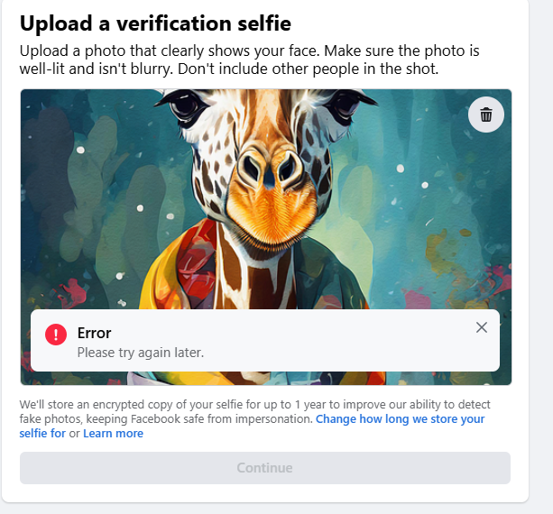
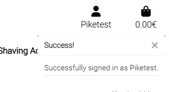

# **ECO-SHAVE**

# Overview 

This is a site built for selling shaving products that use DE double-edge razors. I love this way of shaving.
The product does not use the plastic cartridge systems that are so popular today. I feel these systems are wasteful and expensive over time.
Below is my first e-commerce B2C website.

Here is the live deployed site [Eco-Shave](https://eco-shave-7beca10c37e1.herokuapp.com/)
# Table of Contents

- [Objective](#objective)
- [Site User Goal](#site-user-goal)
- [Site Owners Goal](#site-owners-goal)
- [Business Model](#business-model)
  - [Shaving Philosophy](#shaving-philosophy)
  - [Marketing Strategy](#marketing-strategy)
  - [Target Audience](#target-audience)
  - [Marketing used](#marketing-used) 
  - [SEO](#seo)
  - [Future Marketing Ideas](#future-marketing-ideas)
- [User Experience (UX)](#user-experience-ux)
  - [User Stories](#user-stories)
- [Design](#design)
  - [Colours-Backgrounds](#colours-backgrounds)
  - [Colour Scheme](#colour-scheme)
  - [Typography](#typography)
  - [Imagery](#imagery)
  - [Product SKU Format](#product-sku-format)
  - [Skeleton](#skeleton)
  - [Wireframes](#wireframes)
  - [Initial ERD Diagram](#initial-erd-diagram)
  - [Visual Effects](#visual-effects)
- [Features](#features)
  - [Visual Experience](#visual-experience)
  - [Home Page](#home-page)
  - [Product Page](#product-page)
  - [Product Detail Page](#product-detail-page)
  - [Checkout Page & Success Checkout Page ](#checkout-page-&-success-checkout-page)
  - [About Page](#about-us-page)
  - [Contact Page](#contact-page)
  - [Account Login](#account-login)
  - [Register](#register)
  - [Profile](#profile)
  - [Logout](#logout)
  - [Future Features](#future-features)
  - [Technolgies used](#technolgies-used)
- [Agile Methodology](#agile-methodology)
  - [Database](#database)
- [Testing](#testing)
  - [Responsive Layout and Design](#responsive-layout-and-design)
  - [Testing User Stories](#testing-user-stories)
  - [Lighthouse](#lighthouse)
  - [HTML Validation](#html-validation)
  - [CSS Validation](#css-validation)
  - [Manual Testing](#manual-testing)
  - [Frontend](#frontend)
  - [Backend Admin Panel](#backend-admin-panel)
  - [Fixed Bugs](#fixed-bugs)
  - [Unfixed Bugs](#unfixed-bugs)
- [Creating the Django app](#creating-the-django-app)
  - [Deployment of This Project](#deployment-of-this-project)
  - [Final Deployment](#final-deployment)
  - [Forking This Project](#forking-this-project)
  - [Cloning This Project](#cloning-this-project)
- [Credits](#credits)
  - [Acknowledgements](#acknowledgements)

# Project

Everything on this webpage is for educational purposes only. The credit section provides documentation on where pictures and information are coming from.

# Objective

I decided to try building a shaving website because I am interested in this way of shaving.
The objective for me was to create an e-commerce site that sells shaving products.
Try my hand at an e-commerce layout using the Django Framework, Python, JavaScript, CSS, and HTML.


## Site User Goal

This website wants to sell shaving products that will transform your shave and last for a long time.
Also, I tried to educate clients on the benefits of shaving with de razors and single-edge razors in a minimalistic way. 


## Site Owners Goal

The goal is to sell these products online through a Django app that uses secure payment methods like Stripe.

**Project Objectives:**

# Business Model 

This is a B2C (Business To Consumer)-model so when a client buys a product the transaction is completed.
The Django platform is able to upscale when needed and customize when needed, so it is able to adjust to market needs.
The business would like to attract people who want more out of a shave maybe a unique experience from it.  
The company sells shaving products for DE double-edge blades or single-edge blades and accessories.
The razors can be used for a lifetime even passed on to other generations and still customers can get the best shaves.
So in fact each time a customer uses these products they are helping the environment.

## Shaving Philosophy

* The shaving razors are the best in my opinion. After you go through a small learning curve you get the best shaves.
* It's a customizable shave where you can change different accessories such as blades and soaps even your shaving routine plays a role, endless way of customizing your shave.
* Why not turn an everyday shave into a hobby and something to look forward to doing every day?
* DE double edge is newer than the SE single edge razors that date as far back as the Egyptians even further probably. 
* It is a product that can last and the longer it lasts the more you are saving, I will say it's a tool that keeps giving.
* It helps the environment by using a product longer and leaving no waste when discarded. Mostly they are given to another generation.


## Marketing Strategy

### Target Audience
- * The focus would be on people who want products that are sustainable, cost-saving, and bring everyday value.
- * The business would look for online marketing options such as Facebook which has a large market following.

### Marketing used 

* On this site we used an email marketing application called Mailchimp that collects the subscription emails. 
* A mockup of a Facebook page for social media marketing that could be implemented in the future should the site go live. 
* The use of certain SEO search engine optimization strategies such as [wordtracker]( https://www.wordtracker.com/) and [Ubersuggest](https://app.neilpatel.com/) .
* Content marketing was used in this just to educate the users of the site of the benefits of using these products in the FAQ and landing page.

### SEO

* Using Search Engine Optimization (SEO) is a science and when done correctly you should see traffic diverted to the site.
 It is a very important method to improve the ranking on search engines which in turn creates revenue. The goal is to attract people to the site.
 This is not easy when you are competing with so many online shops. To use keywords in the content that match the user's search criteria when using search engines. Descriptive Meta Tags have been implemented on the site after a brainstorming session and the use of [wordtracker]( https://www.wordtracker.com/) and [Ubersuggest](https://app.neilpatel.com/). The final description/words that have been used can be seen below:
 
* - Meta Description - Discover sustainable DE razors and straight razors with all the shaving soaps and shave brushes.

* - Meta Keywords - razor blades, double-edge safety razors, straight razors, single-edge razors, shaving soaps, and shaving brushes.

* The site also includes a sitemap.xml and robots.txt to make sure that the search engines can find and crawl the pages on the site.

### Facebook 

Social Media marketing is a great way to get your product across online as it has a large following.
It has a huge potential for small businesses. This tool helps the eco-shave team as they can interact directly with the customers or potential customers. This can boost the brand and awareness of our business.


<details>
<summary>Facebook</summary>

* I created a mockup of the Facebook page here using the Balsamiq mockups provided by LMS.
 <br>

 

<br>
* I had some problems setting up an account I have provided the error image below.
 I tried registering another account but it kept giving me this error.
<br>


  <br>

</details>

### Budget 

* Since this is a small online shop that is not live yet, free marketing strategies are being used such as Facebook, SEO, and Mail subscription.

## Future Marketing Ideas

* Implement more free social media sites such as TikTok. Instagram ect.
* I would like to do some online instruction videos for the brand on how to use the products.

# User Experience UX

## User Stories

User stories can be viewed here on the project [kanban board ](https://github.com/users/Marceillo/projects/10)

<details>
  <summary>User Stories</summary>

| **EPIC** | **ID** | **Priority** | **User Story** |
|-----------------------------------|--------|---------------|-----------------------------------------------------------------------------------------------------------------------------------------------------|
| **E-commerce Integration** | 1.1    | Must-Have     | As a user, I want to add products to a shopping cart and proceed to check out, so I can easily make purchases on the site.                        |
|                                   | 1.2    | Must-Have     | As a user, I want to receive confirmation of my purchase via email and on-screen notifications, so I can verify my order.                         |
|                                   | 1.3    | Should-Have   | As a user, I want a streamlined checkout process, so I can complete my purchases efficiently.                                                      |
| **User Experience Design** | 2.1    | Must-Have     | As a user, I want an accessible and intuitive website, so I can navigate and interact with the content seamlessly.                                  |
|                                   | 2.2    | Must-Have     | As a user, I want a mobile-responsive design, so I can access the website on different devices.                                                    |
|                                   | 2.3    | Should-Have   | As a user, I want to edit and view my profile information, so I can keep my account details up-to-date.                                           |
|                                   | 2.4    | Should-Have   | As a user, I want to create and manage a wishlist within my profile modal, so I can save products for future consideration.                        |
| **Search Engine Optimization** | 3.1    | Must-Have     | As a user, I want to find products quickly using search functionality, so I can locate items efficiently.                                          |
|                                   | 3.2    | Should-Have   | As a user, I want a helpful 404 error page with navigation options, so I can find my way back to the main site if needed.                         |
| **Authentication and Authorization** | 4.1  | Must-Have     | As a user, I want to register and log in securely to access my account information.                                                                 |
|                                   | 4.2    | Must-Have     | As an admin, I want to manage user roles effectively, so I can control access levels based on user roles.                                          |
|                                   | 4.3    | Should-Have   | As a user, I want to see my login status clearly on every page.                                                                                   |
| **Marketing and Brand Reach** | 5.1    | Must-Have     | As a user, I want to subscribe to newsletters for updates and promotions.                                                                          |
|                                   | 5.2    | Should-Have   | As a user, I want to share products on social media easily to recommend them to friends.                                                           |
| **E-commerce Fundamentals** | 6.1    | Must-Have     | As a business owner, I want to document the e-commerce model clearly to outline the application’s purpose and user value.                       |
| **Customer Support and Information Access** | 7.1  | Must-Have     | As a user, I want to submit a contact form so that I can easily reach out for support or inquiries.                                                |
|                                   | 7.2    | Must-Have     | As a user, I want to view frequently asked questions in a modal so that I can find quick answers without leaving the About Page.                   |
|                                   | 7.3    | Should-Have   | As a user, I want the contact form and FAQ modal to be mobile-responsive so that I can access them on any device.                                  |


</details>

[Back to Table of Contents](#table-of-contents)


# Design

### Colours-Backgrounds

* Each page is similar but a bit different the colors are similar with white and a #ddd background color.
* I created the style while developing the site with each app some have different backgrounds.
* For the home page background and all the other background images I used a free AI tool [Bing](https://www.bing.com/images/create?FORM=IRPGEN) to generate them as finding an image that I like was difficult.   
* I found a free template from [bbbootstrap](https://bbbootstrap.com/snippets/bootstrap-ecommerce-shopping-cart-item-summary-44021562) and used this as a base to style some of the apps.

### Colour Scheme

* Used a [Coolors website](https://coolors.co/palettes/trendin) to search for colors that match but in the end, stayed with the simplistic design.

### Typography

* The Roboto font is the main font, and Lato is the secondary font used for the whole project.

[Back to Table of Contents](#table-of-contents)

### Imagery

* I used the images for the products from the manufacturer's website of the products.
* For some background images I used a Ai AI-generated tool from Bing more on this in features.

#### Product SKU Format

* This is a format for each product that will have a different SKU so that it can be used now and in future features.
* In the future of this business when stock becomes larger it can be used to help with stock management.
* - Inventory tracking 
* - Streamlining Point of sale (POS) Operations 
* It can be used for sales data analysis and other applications.

<details>
<summary>SKU below an example of the format</summary>

| SKU              | Product Type                   |
|------------------|--------------------------------|
| SR-001-STR-2024  | Straight Razor 2               |
| SR-002-RAZ-2024  | Razor                          |
| SR-003-BRS-2024  | Brush                          |
| SR-004-SAP-2024  | Soap                           |
| SR-005-CRE-2024  | Cream                          |
| SR-006-BLA-2024  | Blade                          |
| SR-007-SAF-2024  | Safety Razor 3                 |
| SR-008-PRE-2024  | Pre-shave                      |
| SR-009-BAG-2024  | Bag                            |
| SR-010-BRT-2024  | Brush Restorer Tool            |
| SR-011-SHM-2024  | Shaving Mug                    |
| SR-012-MUG-2024  | Mug                            |
| SR-013-RUB-2024  | Rub                            |
| SR-014-LTH-2024  | Leather                        |
| SR-015-TOW-2024  | Towel                          |
| SR-016-FLA-2024  | Flannel                        |
| SR-017-PAD-2024  | Pad                            |
| SR-018-KIT-2024  | Kit                            |
| SR-019-GEL-2024  | Gel                            |
| SR-020-WAX-2024  | Wax                            |
| SR-021-FIN-2024  | Finish                         |
| SR-022-COM-2024  | Comb                           |
| SR-023-SCR-2024  | Scraper                        |
| SR-024-RAS-2024  | Razor Stand                    |
| SR-025-HOL-2024  | Holder                         |
| SR-026-SLI-2024  | Slitter                        |
| SR-027-PEN-2024  | Pen                            |
| SR-028-CAP-2024  | Cap                            |
| SR-029-DIS-2024  | Dispenser                      |
| SR-030-BLK-2024  | Black Razor                    |

</details>
<br>

# Skeleton

## Wireframes

There might be some small visual differences as this was due to design choices made while building the site.

* The wireframes for mobile and desktop and used [Balsamiq](https://balsamiq.com/)

<br>
<details>
  <summary>Wire Frames</summary>
  <h4>Home page</h4>
  <br>
  <h4>Products</h4>
  <br>
  <h4>Product Detail</h4>
  <br>
  <h4>About</h4>
  <br>
  <h4>FAQ</h4>
  <br>
  <h4>Conact Us</h4>
  <br>
  <h4>Product Management & Edit</h4>
  <br>
  <h4>Profile</h4>
  <br>
  <h4>Profile Edit</h4>
  <br>
  <h4>Wish List </h4>
  <br>
  <h4>Shopping Bag </h4>
  <br>
  <h4>Checkout</h4>
  <br>
</details>

<br>

### Initial ERD Diagram

<details>
<summary>My Intial ERD Diagram</summary>

* For the initial ERD diagram plan, I used [lucid chart](https://www.lucidchart.com/)
* There are some design differences made during the project build just as a side note.
<br>
<br>

<br>
<br>
</details>

## Django ERD Diagram

<details>
<summary>Used code Django to get an ERD.dot file and convert it to ERD Diagram</summary>
Django has a built-in tool that can show you your ERD diagram.

### Reason 

* It is not always possible to start a project from scratch sometimes it may be the case that you need to work on someone else project.
* So this will give me as a developer an overview of the project from an ERD standpoint.
* Also was good to see how everything is connected at the end of the project.

### Steps used
* Step 1 to using this is to install python3 -m pip install django-extensions.
* Step 2 would be to add the installed apps in settings (django_extensions) .
* Step 3 would be to add it to the requirements file.
* Step 4 is to run the python3 manage.py graph_models -a --output erd.dot 
* Step 5 After this it will create an erd. Dot file with all the application model data.
* Step 6 Put the data in this software to change to an image file much like the one I used below.

The red dot file converted to image [Graphviz online](https://dreampuf.github.io/GraphvizOnline/#digraph%20G%20%7B%0A%0A%20%20subgraph%20cluster_0%20%7B%0A%20%20%20%20style%3Dfilled%3B%0A%20%20%20%20color%3Dlightgrey%3B%0A%20%20%20%20node%20%5Bstyle%3Dfilled%2Ccolor%3Dwhite%5D%3B%0A%20%20%20%20a0%20-%3E%20a1%20-%3E%20a2%20-%3E%20a3%3B%0A%20%20%20%20label%20%3D%20%22process%20%231%22%3B%0A%20%20%7D%0A%0A%20%20subgraph%20cluster_1%20%7B%0A%20%20%20%20node%20%5Bstyle%3Dfilled%5D%3B%0A%20%20%20%20b0%20-%3E%20b1%20-%3E%20b2%20-%3E%20b3%3B%0A%20%20%20%20label%20%3D%20%22process%20%232%22%3B%0A%20%20%20%20color%3Dblue%0A%20%20%7D%0A%20%20start%20-%3E%20a0%3B%0A%20%20start%20-%3E%20b0%3B%0A%20%20a1%20-%3E%20b3%3B%0A%20%20b2%20-%3E%20a3%3B%0A%20%20a3%20-%3E%20a0%3B%0A%20%20a3%20-%3E%20end%3B%0A%20%20b3%20-%3E%20end%3B%0A%0A%20%20start%20%5Bshape%3DMdiamond%5D%3B%0A%20%20end%20%5Bshape%3DMsquare%5D%3B%0A%7D)
<br>
<br>
<br>

## Credit below for the above-detailed ERD diagram.

[YouTube link](https://www.youtube.com/watch?v=qzrE7cfc_3Q&t=357s)
[django-extensions](https://django-extensions.readthedocs.io/en/latest/graph_models.html)

</details>

## Visual Experience

* This is based on e-commerce so the design was focused on this so that customers can see what they are buying. 
* The product detail has a carousel that shows more images of the product so as to have more detail of the product.
* I could do more when it comes to improving the visual experience the goal is that it is functional.

[Back to Table of Contents](#table-of-contents)

## Features

### Home Page

* Styling : Used one of bootstrape [4.6 template example](https://getbootstrap.com/docs/4.6/examples/carousel/) example for the carousel and styled from there.  
* Image: I used a [Ai generatied image](https://www.bing.com/images/create?FORM=GENILP) as I could not find a image that matches.
* When a user is logged in it will show their name but when not it will show Your Profile.

<br>
<details>
<summary>Home Page and footer Summary</summary>
<br>


<br>

### Footer

* Has social website links to Facebook, and a newsletter subscription.
* The newsletter is a mail chimp subscription and when you click on it it has a success message.
* - I do not like the default success view of MailChimp and due to time constraints, this is why I used this.

<br>

##### Footer


<br>

##### MailChimp Footer view


##### MailChimp Success


##### MailChimp subscriber list


</details>

### Product & Product Detail

<details>
<summary>Product & Product Detail summary</summary>

### Products Page 

* Feature :[django-star-ratings](https://django-star-ratings.readthedocs.io/en/latest/) This is a software install that handles the ratings which are different from the LMS. This also has full CRUD functionality and only logged-in users can rate. 
* Have sorting features been implemented similar to the LMS sort price, and category of products?
* I did not implement the star rating as a sorting due to the way Django star rating works will do this as a future feature.
* The Images used for the products were used by the manufacturers and will be credited in the credit section.
* I provided the image view of admin as it has the edit and delete buttons when logged in as admin.
* In the admin view you can edit and delete and you have a link to product management where you can add a product will add more detail below.

##### Products Page 


##### Star Rating

* The software gives an average count and rating count and you change your rating or clear it.


### Product Detail Page

* Feature : [Multiview feature](https://djangoguide.com/django-image-upload-specialization/django-multiple-image-upload/) from Django that allows for one object to have multiple images. When the admin view you can add as many images as you like and delete them.
* These images have a carousel and slide left to right with information on the right for the product.
* This was a bit difficult to add in the view on the front end, but you can when you go to edit and add images on the add image view you are limited to two image fields.
* - The Multiview is an extra model and has CRUD functionality.  
* Feature :[django-star-ratings](https://django-star-ratings.readthedocs.io/en/latest/) This is a software install that handles the ratings which are different from the LMS.
* - The LMS had a rating system but was set up differently than has been done on this site with full CRUD as mentioned in the products.
* In this view you can add to the bag if you wish to purchase or continue shopping.
* I have also added a wish list button that changes the words of the button based on whether a product is in the wish list or not.  
* - The wish list is only available when you are logged in.

##### Products Details image 


### Product Management 

* When in admin view you can edit and delete the product.
* There is a delete confirmation when wanting to delete a product.
* There is a dropdown link that says product management there you can add the product and info.
* Edit  Here you can also add information and add more images in the multiple images preview image and CRUD functionality. 
* The is active I will add this in as a future upgrade to signal that a product is available or not.   

##### Edit Product


##### Add Product


##### Delete confirmation message 


</details>

### Shopping Bag Page

<details>
<summary> Shopping Bag summary</summary>

* Note: The bag app was really difficult to set up when not doing it exactly like the LMS.
* - Side note I had little support from tutoring as in the beginning things were very different. So they guided me to make it similar to the LMS. 
* - Learning is about trying new things and making mistakes, I believe from this I learned that variables should be consistent the hard way.
* - Problem 1: The adding of image and date to the bag app. The solution was had to redo the bag/views,context.py several times.
* - Problem 2: The remove button was not working as I was not consistently using strings for keys, after all the refactoring and print logs problem was resolved.
* Styling : I used a [free template](https://bbbootstrap.com/snippets/bootstrap-ecommerce-shopping-cart-item-summary-44021562) and customised it to the bag app 
* In the bag you can update the quantity or decrease it and you can go to check out from here there are toast messages as well when items get added to from the product details page.

##### Shopping Bag


### Checkout Page & Success Checkout Page

* Note: This is a page to allow the user to fill out their personal details and delivery information.
* Bug fix: The Checkout success page was not showing up after confirming the form repaired views the problem was the element for the javascript was not in the  
 layout.   
* - Setup stripe as per the LMS the views have changed in the last years but still managed to create an account and set up with strip functionality.
* There is a form that links up to Strip and confirms the order then gives a success message when completed 

##### Checkout


##### Checkout Success


</details>


### User Profile 

<details>
<summary> Profile & Wish List summary</summary>

* The page for the profile shows the order history and the profile information.
* Here I tried to implement a flip animation feature but had problems with styling so I changed it to save time.
* A user can edit their profile when they enter incorrect information they might not get their product.
* Delete profile feature I would like to add this in the future.
* I added an image field feature should the user want to update their image.
* I styled it similar to the bag template so that the order history is on the left and the right profile summary.
* The edit profile goes to a separate html document.
* There is an option to go to the wishlist from the profile view.
* When a user clicks on the order history it will show the checkout success page.

##### 


##### Profile Edit 


### Wish List 

* The wish list has CRUD functionality as you add and remove an item to the wish list and update the star rating.
* You can add to the wish list through buttons on the product detail page as shown in product details.
* You can also add items to the bag that you would like to purchase.
* You can delete it from the wish list.
* The wish list is only available when logged in.

##### Wish List


</details>

### About Page

<details>
<summary>About, FAq, Contact us summary</summary>
<br>

* The About is a basic page with a contact form for users to get in contact with eco-shaves.

<br>


<br>

##### Contact Us

* Note: This is a basic page with a contact form for users to send an email and a message.


##### Contact us message 


### FAQ

* This is a model with a questions and answers field.
* The admin user has CRUD functionality I included the image with the CRUD View for super users.
* display message for each update when updating the FAQ also added below 

##### FAQ


##### Add FAQ


##### Edit FAQ


##### Confirm delete message FAQ


##### Update message delete


##### Update message edit


##### Update message add


</details> 

### AllAuth 

<details>

<summary> Allauth Page summary</summary>


<br>

### Register an account 

* Note: Here the user can register an account for more features in order to have some CRUD functionality.
* 

<br>

##### Register view 


##### Confirm email message


##### Verify email message 


##### Confirm email in inbox


#### 

### Login page

* Note: Here you can log in using the allauth tool in Django.
* However it is not 100 percent as certain mail servers block Django messages. 

<br>

##### Login


##### Login success



#### Forgot Password

<br>

* When you click on the forgot password you will be prompted for your email address.

<br>

##### forgot 


<br>

* Once you enter your e-mail address you will see this screen as a user.

<br>

##### Forgot email in email inbox


##### change password 


#### Success message


##### NOTE:

* The link will be sent to the IDE terminal and only to certain email service providers.
* The reason for this is that certain service providers block Django messages on the server side such as Gmail.
* This is not a live site and not in control of the SMTP server I have to accept this result.


###### Temporary email address view tests

* The way I tested this was to use a temporary [ temporary e-mail service provider](https://temp-mail.org/).
* Created a user account with the temp email service provider and tested this.

</details>

### Confirmation Messages 
<details>
<summary>Confirmation messages</summary>

* There are success confirmation messages and error messages toasts where used. 
* There is Java Script and Mondal code inspired by the LMS.
* Not going to show all of them as you will see them in the project.
* Logging in and out
* Registering a new account
* Buying a product ect
* When registering a new account
* In most of the apps in the project.
 


</details>

### Future Features

* I had some problems implementing the sorting feature with the Django star rating but due to time constraints left this one out but will be implementing it at a later date.
* In the user's profile there are features of crud but I would like it add a delete profile feature in the future this was also not implemented due to time.
* - Also in the profile I would have liked it when a user is logged in with their name not to be able to change the data.   
* I did not include Pagination the number of products per page so will be the next future feature when the site grows.
* I would have liked a better way to handle returns should a product have a defect, write now they can just send a message with problems in the contact form.
* I would add some testimonials for each product in the future.
* More social media platforms 
* Also a brand app that shows the details of the product manufacturer and their carbon footprint.
* More styling as I focused on this project on functionality. 

[Back to Table of Contents](#table-of-contents)

## Technologies Used

### Dependencies
<details>
<summary>Dependencies used summary</summary>

This is a simple description of the key dependencies used in the app.

- **asgiref==3.8.1**: A library that provides utilities for ASGI (Asynchronous Server Gateway Interface) applications.
- **boto3==1.35.59**: The official AWS SDK for Python, enabling easy integration with AWS services like S3 and EC2.
- **botocore==1.35.59**: A low-level interface to AWS services that serves as the foundation for Boto3, providing service definitions and API operations.
- **crispy-bootstrap4==2024.1**: A Django application that provides Bootstrap 4 support for crispy forms, enhancing form styling.
- **dj-database-url==2.2.0**: A utility for parsing database URLs to configure Django's database settings easily.
- **Django==4.2.8**: A high-level Python web framework that encourages rapid development and clean, pragmatic design.
- **django-allauth==0.54.0**: An integrated set of Django applications addressing authentication, registration, account management, and third-party (social) account authentication.
- **django-braces==1.16.0**: A collection of reusable class-based view mixins for Django that simplify common patterns in view logic.
- **django-countries==7.6.1**: A Django application that provides a country field for models and a list of countries with their ISO codes.
- **django-crispy-forms==2.3**: A Django application that helps manage the rendering of forms with a focus on DRY (Don't Repeat Yourself) principles and flexibility in the form layout.
- **django-extensions==3.2.3**: A collection of custom extensions for Django that enhance the development experience with additional management commands and features.
- **django-model-utils==5.0.0**: A set of utilities for Django models that provide additional functionality such as inherited model fields and model managers.
- **django-star-ratings==0.9.2**: A Django application that allows users to rate items using star ratings, providing an intuitive feedback mechanism.
- **django-storages==1.14.4**: A Django library that provides storage backends for various cloud storage services like Amazon S3 and Google Cloud Storage.
- **gunicorn==23.0.0**: A Python WSGI HTTP server for UNIX that concurrently serves web applications, ideal for production environments.
- **jmespath==1.0.1**: A query language for JSON, allowing you to extract and transform JSON data easily from Python applications.
- **oauthlib==3.2.2**: A generic, spec-compliant implementation of OAuth for Python, enabling secure authorization flows in applications.
- **pillow==10.4.0**: The Python Imaging Library fork (PIL) that adds image processing capabilities to your Python interpreter.
- **psycopg2==2.9.10**: A PostgreSQL adapter for the Python programming language, allowing interaction with PostgreSQL databases.
- **psycopg2-binary==2.9.9**: A stand-alone package of psycopg2 that includes the binary dependencies needed to connect to PostgreSQL without requiring compilation.
- **PyJWT==2.9.0**: A Python library for encoding and decoding JSON Web Tokens (JWT), facilitating secure token-based authentication.
- **python3-openid==3.2.0**: An OpenID consumer library for Python 3, enabling authentication using OpenID providers.
- **pytz==2024.2**: A library that brings the Olson timezone database into Python, allowing accurate timezone calculations and conversions.
- **requests-oauthlib==2.0.0**: An extension of the Requests library that adds OAuth support, simplifying the process of making authenticated API requests.
- **s3transfer==0.10.3**: A library that provides a high-level interface for transferring files to and from Amazon S3 with support for multipart uploads and downloads.
- **sqlparse==0.5.1**: A non-validating SQL parser for Python that provides syntax highlighting and formatting capabilities for SQL queries.
- **stripe==11.2.0**: The official Stripe API client library for Python, facilitating integration with Stripe's payment processing services.
- **swapper==1.4.0**: A utility for swapping out models in Django applications dynamically, allowing flexible model management during development or testing.
- **typeguard==2.13.3**: A runtime type checker for Python functions that validates argument types against type hints during execution.

</details>

### Tools Used

[GitHub](https://github.com/) - used for hosting the source code of the program<br>
[Heroku](https://dashboard.heroku.com/) - used for deploying the project<br>
[Font Awesome](https://fontawesome.com/) - for creating atractive UX with icons<br>
[Bootstrap4.6](https://getbootstrap.com/) - for adding predefined styled elements and creating responsiveness<br>
[Google Fonts](https://fonts.google.com/) - for typography<br>
[JsHint](https://jshint.com/) - used for validating the javascript code<br>
[PEP8 Validator](http://pep8online.com/) - used for validating the python code<br>
[HTML - W3C HTML Validator](https://validator.w3.org/#validate_by_uri+with_options) - used for validating the HTML<br>
[CSS - Jigsaw CSS Validator](https://jigsaw.w3.org/css-validator/#validate_by_uri) - used for validating the CSS<br>
[GraphvizOnline](https://dreampuf.github.io/GraphvizOnline/#digraaph%20G%20%7B%0A%0A%20%20subgraph%20cluster_0%20%7B%0A%20%20%20%20style%3Dfilled%3B%0A%20%20%20%20color%3Dlightgrey%3B%0A%20%20%20%20node%20%5Bstyle%3Dfilled%2Ccolor%3Dwhite%5D%3B%0A%20%20%20%20a0%20-%3E%20a1%20-%3E%20a2%20-%3E%20a3%3B%0A%20%20%20%20label%20%3D%20%22process%20%231%22%3B%0A%20%20%7D%0A%0A%20%20subgraph%20cluster_1%20%7B%0A%20%20%20%20node%20%5Bstyle%3Dfilled%5D%3B%0A%20%20%20%20b0%20-%3E%20b1%20-%3E%20b2%20-%3E%20b3%3B%0A%20%20%20%20label%20%3D%20%22process%20%232%22%3B%0A%20%20%20%20color%3Dblue%0A%20%20%7D%0A%20%20start%20-%3E%20a0%3B%0A%20%20start%20-%3E%20b0%3B%0A%20%20a1%20-%3E%20b3%3B%0A%20%20b2%20-%3E%20a3%3B%0A%20%20a3%20-%3E%20a0%3B%0A%20%20a3%20-%3E%20end%3B%0A%20%20b3%20-%3E%20end%3B%0A%0A%20%20start%20%5Bshape%3DMdiamond%5D%3B%0A%20%20end%20%5Bshape%3DMsquare%5D%3B%0A%7D) - To take erd. dot file and convert to a graph<br>
LightHouse in the browser- for testing performance<br>
[AWS](https://aws.amazon.com/) Used for storage of the files folders.<br>
[CI database](https://dbs.ci-dbs.net/)<br>
[temp-mail](https://temp-mail.org/en/)<br>
[grammarly](https://app.grammarly.com/) spell checker for this readme.<br>
[Stripe](https://stripe.com/en-de) Used for a secure card payment system <br>
[Back to Table of Contents](#table-of-contents)<br>


## Database

During this project, I used the PostgreSQL  and the AWS S3 Bucket for storing data.
I have also used Graph MOdels to show the relationship with the database and used lucid charts in the beginning to plan for the intial MVP build.

## Agile Methodology
This project was developed using the Agile methodology.<br>
All epics and user stories implementation progress was registered using [Github](https://github.com/users/Marceillo/projects/10). As the user stories were accomplished, they were moved in the Kanban Board from **Epic**,**User stories**, **No Status**, **To Do**, to **In-progress**, and **Done** . As the last test before moving to done, I tested them again during my testing process.

I used epics to help with organizing the project and MoSCoW prioritization Labels were also included in each issue. 

### env file setup in both Heruko and IDE 


# Testing 

* I have created a separate readme file for testing.
* Please click on this link [(Testing)](TESTING.md) to take you to the page .


[Back to Table of Contents](#table-of-contents)

# Deployment of this project

<details>
<summary>Deployment summary</summary>

### Helpful guide links 

[Django](https://docs.djangoproject.com/en/5.1/topics/install/)
[Django Central](https://djangocentral.com/building-a-blog-application-with-django/#pre-requirements)

* A small note: This is a simple guide to how to get the app up and running.
* Should certain sections not seem clear there is a large number of resources that can clarify the below steps if not clear.

The project was deployed to [Heroku](https://www.heroku.com). To deploy a project, these are the steps:

1. Begin by creating a GitHub repository I used this template [Code Institute template](https://github.com/Code-Institute-Org/gitpod-full-template). Navigate to the template and select use. This was the step I used you can create this differently.

2. 'Create Repository From the Template.

3. After the repository is created, click on 'Gitpod'.

4. Install Django by entering this command in the terminal:

* ```pip3 install Django~=4.2.1``` 
* The best is to see what is the latest version and if compatible with the software you plan to install.

5. Generate a requirements file using the following command:

* ```pip3 freeze --local > requirements.txt``` - This will create the requirements.txt file and add the required libraries to it. This command needs to be executed every time a new library gets added to the project.

6. Create your project:

* ```django-admin startproject YOUR_PROJECT_NAME .``` - "YOUR_PROJECT_NAME" is the name you choose for your project.

7. Create your application using:

* ```python3 manage.py start app APP_NAME``` - This will create your application with the name "APP-NAME"

8. Add your local server to "ALLOWED_HOSTS" in the settings.py file. For this, you need to run the command

* ```python3 manage.py runserver``` - This runs the server. This will give you an error message "DisallowedHost at /", following the link of your local server. Copy this link and add it to your settings.py file.
* While in the settings.py file, also add your newly created app in the "INSTALLED_APPS" section at the bottom of the list. In the picture, the first app is called "APP".

9. To get the code ready for deployment, gunicorn needs to be installed and added to the requirements with the following commands:

* ```pip3 install gunicorn~=20.1``` - This installs gunicorn
* ```pip3 freeze --local > requirements.txt``` - This will add gunicorn to the requirements.txt file

10. Create a file in the root directory named "Procfile" and add the necessary lines to the settings.py file:

- Procfile:
* ```web: gunicorn "proejec_name".wsgi``` - "project_name" stands for the name of your project
- settings.py:
* ```DEBUG = False``` - This is the debug line in the settings.py file. It is very important that debug is never set to "True" on a deployed webpage for security reasons. While in development, DEBUG should be set to "True"
* ```,'.herokuapp.com'``` needs to be added to the "ALLOWED_HOSTS" section in the settings.py file, so that Heroku has permission to access the project.

11. Now it is time to create the application on Heroku:

* Head on to [Heroku](https://www.heroku.com/) and sign in (or create an account if needed).

* In the top right corner there is a button that is labeled 'New'. Click that and then select 'Create new app'.

12. On Heroku, enter a unique application name, choose your region, and click 'Create app':

13. I used the Postgres database provided by Code Institute, [PostgresSQL](https://dbs.ci-dbs.net/) in the LMS course material.

* Press "Reveal Config Vars" and add "DATABASE_URL" as the key and enter the Postgres URL, which has been sent by email, as the value.
* Additionally, add the "DISABLE_COLLECTSTATIC" key with a value of "1" as a second config var. This is necessary for the later implementation of the Cloudinary API.

14. In GitPod, create an env.py file in the top-level directory with the following content:

* ```import os``` - This imports the os library
* ```os.environ("DATABASE_URL", "postgres://*********************")``` - This sets database variable to your PostgresSQL database.
* ```os.environ("SECRET_KEY", "actual_secret_key")``` - You can create your own key with a webpage like [RandomKeyGen](https://randomkeygen.com/).
* if using the Code Institute template, the env.py file should already be in the "gitignore" file, if not, it has to be added manually.

15. Add your secret key to Heroku's Config Vars and your env variables used: Look at step 13

16. In settings.py, add the following code:

```import os```

```import dj_database_url```

```if os.path.isfile("env.py"):```

```import env```

17. Replace the insecure secret key in settings.py with:
```SECRET_KEY = os.environ.get('SECRET_KEY')```

18. Comment out the old database settings and add the link to DATABASE_URL since the project does not use the standard SQLite3 database. 

```DATABASES = {'default': dj_database_url.parse(os.environ.get("DATABASE_URL"))}```

18. Save all your fields and migrate the changes with the following commands:

```python3 manage.py migrate```

19. To set up Stripe, you will have to create a free account [Stripe](https://dashboard.stripe.com/register). After you have created your account, retrieve your Publishable key and Secret key and add them to your env.py file, as well as to your Heroku config vars. Additionally, you will have to set up all the stripe codes for your project, but this was done with the [Stripe Documentation](https://docs.stripe.com/). It is important to include the following code in the checkout views.py file: 

20. Create a stripe webhook for your platform by creating a new webhook in the stripe section under *Developers* - *Event Destination* - *Add Destination* and adding your *deployed url*/checkout/wh/ in the form. After creating the webhook, you will receive a stripe_wh_secret key.

21. The next step to complete the deployment is to create an AWS account and an S3 bucket. To create an account, you have to visit the [AWS website](https://signin.aws.amazon.com/signup?request_type=register) and follow the instructions to create the free tier account.

* - Code Institute tutor Oisin's instructions helped me setup the AWS with the below instructions:
* - [Create an AWS S3 Bucket](https://docs.google.com/document/d/1bqvCFiCW_JV9sllNZrN5uUJpIiusHICTk4TIk3oUWHY/edit?tab=t.0#heading=h.jypp4mbtvx4q)
* - [Create an AWS Group and User](https://docs.google.com/document/d/1z6L8KKiTi3QU5rMbHXhA3QR9jQIG7wLqnScUDpe238E/edit?tab=t.0#heading=h.1ixuny26uvc)
* - After finishing the steps from the documentation above, you will receive an AWS access key and an AWS secret key.

22. Add all keys into your env.py file and the Heroku config vars.


23. * Install **boto3** and **django-storages**

24. Update your settings.py to set up the storage file.


#### Extra variables added to the env file.

* The below variables were added after the initial deployment 
* ```os.environ.setdefault("EMAIL_HOST_PASS", "your_email_password")``` sets the default values for the email host user and password environment variables. Which are used to configure the email-sending functionality for the forgot password feature when deploying your application to Heroku.

## Final Deployment 

1. Create a Profile `web: gunicorn your_project_name.wsgi`
2. When development is complete change the debug setting to: `DEBUG = False` in settings.py
3. In Heroku settings, delete the config vars for `DISABLE_COLLECTSTATIC = 1`

</details>

[Back to Table of Contents](#table-of-contents)

## Forking This Project

* To fork this project by following the steps below:

1. Open [GitHub](https://github.com/hughes84/my-blog-pp4.git)
2. Find the 'Fork' button at the top right of the page
3. Once you click the button the fork will be in your repository

## Cloning This Project

* Clone this project by following the steps:

1. Open [GitHub](https://github.com/Marceillo/kayak-blog-pp4).
2. You will be provided with three options to choose from: HTTPS, SSH, or GitHub CLI. Click the clipboard icon to copy the URL of your preferred option.
3. Once you click the button, the fork will be in your repository (if you choose to fork it).
4. Open a new terminal.
5. Change the current working directory to the location where you want the cloned directory.
6. Type `git clone` followed by pasting the URL copied in step 2.
7. Press 'Enter' to clone the project.

[Back to Table of Contents](#table-of-contents)

To clone and set up this project, follow these steps:

1. When you are in the repository, find the "Code" tab and click it.
2. To the left of the green "Code" button, press the 'code' menu. There you will find a link to the repository. Click on the clipboard icon to copy the URL.
3. Use an IDE and open Git Bash. Change the directory to the location where you want the cloned directory to be created.
4. Type `git clone`, and then paste the URL that you copied from GitHub. Press 'Enter' to create a local clone.

5. To get the project to work, install the required dependencies using the command below:

 ```bash pip3 install -r requirements.txt```

6. This step is to set up the environment file so that the project knows what variables need to be used for it to work. Environment variables are usually hidden due to sensitive information. You mustn't push the env.py file to Github (this can be secured by adding env.py to the .gitignore-file). The variables that are declared in the env.py file need to be added to the Heroku config vars. Don't forget to do the necessary migrations before trying to run the server.

* ```python3 manage.py migrate``` - This will do the necessary migrations.
* ```python3 manage.py runserver``` - If everything I set up correctly the project is now live locally.
* ```python3 manage.py createsuperuser ``` - Create super user as you will need this to access the admin panel.
7. In GitPod, create an env.py file in the top-level directory with the following content:
* ```import os``` - This imports the os library
* ```os.environ("DATABASE_URL", "postgres://*********************")``` - This sets database variable to your PostgresSQL database.
* ```os.environ("SECRET_KEY", "actual_secret_key")``` - You can create your own key with a webpage like [RandomKeyGen](https://randomkeygen.com/).
* ```os.environ.setdefault("EMAIL_HOST_PASS", "your_email_password","DEVELOPMENT", "1")```sets the default values for the email host user and password environment variables
 
## Credits

* The [Bootstrap](https://getbootstrap.com/) documentation was so really helpful.
* The *Boutique Ado* code along project from Code Institute has been a valuable source for both starting the project as well as for setting up new apps, models, URLs views, and templates.
* - Could not have done it without the assistance of this material. 
* I have used different websites and content during this process I found that dajango documentation was the best and the more common sites like stack overflow.
* I also took some inspiration from the readme files below and adjusted them to meet my project.
* AI [perplexity](https://www.perplexity.ai/) helped with writing the FAQ question and answer. Also as a learning tool to explain and help with bug errors found.     
* [Ian-Garrigan](https://github.com/Ian-Garrigan/shavers-haven?tab=readme-ov-file)
* [django-extensions](https://django-extensions.readthedocs.io/en/latest/graph_models.html)
* [Coolors web site](https://coolors.co/palettes/trendin)
* [Book on django](https://www.amazon.de/-/en/Antonio-Mel%C3%A9-ebook/dp/B0CPN3H5YW#:~:text=Django%205%20By%20Example%20is,step%2Dby%2Dstep%20approach)
* [guide to the Github Agile Tool](https://www.youtube.com/watch?v=U_dMihBgUNY&list=PL_7334VduOHsrWzhu5Ta2lrkp016kcBWY&index=34)
* [ERD youtube](https://www.youtube.com/watch?v=xsg9BDiwiJE)
* [User account create Django](https://youtu.be/Ev5xgwndmf)
* [Website for django blog](https://djangocentral.com/building-a-blog-application-with-django/#database-models)
* [Website stackoverflow](https://stackoverflow.com)
* [Forms stackoverflow](https://stackoverflow.com/questions/1727564/how-to-create-a-userprofile-form-in-django-with-first-name-last-name-modificati)
* [Forgot Password](https://stackoverflow.com/questions/67545932/how-can-i-send-a-reset-password-email-on-django)
* [Images and mp4 video used pexels](https://www.pexels.com)
* [Images used unsplash](https://unsplash.com/)
* [widgets in Django used in forms blog ](https://docs.djangoproject.com/en/5.0/topics/forms/modelforms/)
* [search function](https://blog.csdn.net/bbwangj/article/details/98026817)
* [Django documentation](https://docs.djangoproject.com/)
* [Django Queryset API](https://docs.djangoproject.com/en/stable/ref/models/querysets/)
* [Django Pagination](https://docs.djangoproject.com/en/stable/topics/pagination/)
* [Django Q objects](https://docs.djangoproject.com/en/stable/topics/db/queries/#complex-lookups-with-q-objects)
* [allauth ](https://docs.allauth.org/en/latest/installation/quickstart.html )
* [Icons for wirframes](https://icons8.com/icons/set/razor--static--black)
* [Freepik foor images](https://www.freepik.com/search?format=search&query=men%20shaving%20%20)
* [AI image generator](https://www.bing.com/images/create?FORM=IRPGEN)
* [Dango MUltiview](https://djangoguide.com/django-image-upload-specialization/django-multiple-image-upload/)
* [Star Rating](https://django-star-ratings.readthedocs.io/en/latest/?badge=latest/)
* [Mocups](https://techsini.com/multi-mockup/)
* [Image for Tatara razors](https://tatararazors.com/product-category/razors)
* [Leaf Shave Images](https://leafshave.com/)
* [Proof razors images](https://proofrazor.com/)
* [Oneblade razors images](https://www.onebladeshave.com/)
* [Dovo images](https://dovo.com/de/)
* [Amazon images]( https://www.amazon.de/)
* [Free templates used](https://bbbootstrap.com/snippets/bootstrap-ecommerce-shopping-cart-item-summary-44021562)
* [Bootstrape template used](https://getbootstrap.com/docs/4.6/examples/carousel/)

 
## Credits

* The [Bootstrap](https://getbootstrap.com/) documentation was so really helpful.
* The *Boutique Ado* code along project from Code Institute has been a valuable source for both starting the project as well as for setting up new apps, models, urls and views, templates.
* - Could not have done it without this assistance of this material.. 
* I have used differant  website and content during this process I found that dajango documentation was the best and the more common sites like stack overflow.
* I also took some inspiration from the readme files below and adjusted it to meet my project.
* AI [perplexity](https://www.perplexity.ai/) helped with writing the FAQ question and answer. Also as learning tool to explain and help with bug errors found.     
* [Ian-Garrigan](https://github.com/Ian-Garrigan/shavers-haven?tab=readme-ov-file)
* [django-extensions](https://django-extensions.readthedocs.io/en/latest/graph_models.html)
* [Coolors web site](https://coolors.co/palettes/trendin)
* [Book on django](https://www.amazon.de/-/en/Antonio-Mel%C3%A9-ebook/dp/B0CPN3H5YW#:~:text=Django%205%20By%20Example%20is,step%2Dby%2Dstep%20approach)
* [guide to the Github Agile Tool](https://www.youtube.com/watch?v=U_dMihBgUNY&list=PL_7334VduOHsrWzhu5Ta2lrkp016kcBWY&index=34)
* [ERD youtube](https://www.youtube.com/watch?v=xsg9BDiwiJE)
* [User account create Django](https://youtu.be/Ev5xgwndmf)
* [Website for django blog](https://djangocentral.com/building-a-blog-application-with-django/#database-models)
* [Website stackoverflow](https://stackoverflow.com)
* [Forms stackoverflow](https://stackoverflow.com/questions/1727564/how-to-create-a-userprofile-form-in-django-with-first-name-last-name-modificati)
* [Forgot Password](https://stackoverflow.com/questions/67545932/how-can-i-send-a-reset-password-email-on-django)
* [Images and mp4 video used pexels](https://www.pexels.com)
* [Images used unsplash](https://unsplash.com/)
* [widgets in djano used in forms blog ](https://docs.djangoproject.com/en/5.0/topics/forms/modelforms/)
* [search function](https://blog.csdn.net/bbwangj/article/details/98026817)
* [Django documentation](https://docs.djangoproject.com/)
* [Django Queryset API](https://docs.djangoproject.com/en/stable/ref/models/querysets/)
* [Django Pagination](https://docs.djangoproject.com/en/stable/topics/pagination/)
* [Django Q objects](https://docs.djangoproject.com/en/stable/topics/db/queries/#complex-lookups-with-q-objects)
* [allauth ](https://docs.allauth.org/en/latest/installation/quickstart.html )
* [Icons for wirframes](https://icons8.com/icons/set/razor--static--black)
* [Freepik foor images](https://www.freepik.com/search?format=search&query=men%20shaving%20%20)
* [AI image generator](https://www.bing.com/images/create?FORM=IRPGEN)
* [Dango MUltiview](https://djangoguide.com/django-image-upload-specialization/django-multiple-image-upload/)
* [Star Rating](https://django-star-ratings.readthedocs.io/en/latest/?badge=latest/)
* [Mocups](https://techsini.com/multi-mockup/)
* [Image for Tatara razors](https://tatararazors.com/product-category/razors)
* [Leaf Shave Images](https://leafshave.com/)
* [Proof razors images](https://proofrazor.com/)
* [Oneblade razors images](https://www.onebladeshave.com/)
* [Dovo images](https://dovo.com/de/)
* [Amazon images]( https://www.amazon.de/)
* [Free templates used](https://bbbootstrap.com/snippets/bootstrap-ecommerce-shopping-cart-item-summary-44021562)
* [Bootstrape template used](https://getbootstrap.com/docs/4.6/examples/carousel/)


### Content

* [YouTube Graph Models](https://www.youtube.com/watch?v=qzrE7cfc_3Q&t=357s)
* [Youtube Bootstrap](https://www.youtube.com/watch?v=-qfEOE4vtxE)
* [Stripe for payment](https://youtu.be/hZYWtK2k1P8?si=I9KdHXR7xvDcpv8R) 
## Acknowledgements

* I would like to thank code institute for the good LMS they have written that really helped pave the way forward with out it would not have been possible with the time allocated.

* I would like to thank my mentor [Precious Ijege](https://code-institute-room.slack.com/team/USMD0GEAD) for relevant feedback and bug hunting during our meetings.

* I would like to thank student [Sebastian](https://github.com/Mienjung97) and [Jan R](https://github.com/yanidruffy) for all their help in times of need.

* Also would like to say thank you to tutor support and LMS walkthrough.

[Back to Table of Contents](#table-of-contents)