# Table of Contents

- [Testing](#testing)
- [Testing User Stories](#testing-user-stories)
- [Responsive Layout and Design](#responsive-layout-and-design)
- [Python Validation](#python-validation)
- - [PeP8 Errors Fixed](#pep8-errors-fixed)
- [Lighthouse](#lighthouse)
- [HTML Validation](#html-validation)  
- [CSS Validation](#css-validation) 
- [Manual Testing](#manual-testing)
- [Frontend](#frontend)
- [Backend Admin Panel](#backend-admin-panel)
- [Fixed Bugs](#fixed-bugs)
- [Unfixed Bugs](#unfixed-bugs)
 
 

# Testing

 

## User Stories Testing Table

User stories testing table

| EPIC                                 | ID   | User Story                                                                 | Check | Test Result                                                                                      |
| :----------------------------------- | ---- | :------------------------------------------------------------------------- | :---: | :----------------------------------------------------------------------------------------------- |
| **E-commerce Integration**           |      |                                                                           |       |                                                                                                 |
|                                     | 1.1  | As a user, I want to add products to a shopping cart and proceed to check out, so I can easily make purchases on the site. | [x]   | Products can be added, viewed, removed, and adjusted in quantity.                             |
|                                     | 1.2  | As a user, I want to receive confirmation of my purchase via email and on-screen notifications, so I can verify my order. | [x]   | Users receive an email confirmation after a successful purchase.                               |
|                                     | 1.3  | As a user, I want a streamlined checkout process, so I can complete my purchases efficiently.  | [x]   | Users can review their orders and enter payment details easily.                                 |
|                                     | 1.4  | As a user, I want to see order confirmation details clearly after purchase, so I can have a record of my transaction.  | [x]   | Order confirmation details are displayed on the screen immediately after purchase.              |
| **User Experience Design**          |      |                                                                           |       |                                                                                                 |
|                                     | 2.1  | As a user, I want an accessible and intuitive website, so I can navigate and interact with the content seamlessly. | [x]  | The front-end meets WCAG accessibility guidelines.                                             |
|                                     | 2.2  | As a user, I want a mobile-responsive design, so I can access the website on different devices.                       | [x]   | The website layout adapts to various screen sizes (desktop, tablet, mobile).                   |
|                                     | 2.3  | As a user, I want to edit and view my profile information, so I can keep my account details up-to-date.              | [x]   | Users can access and modify their profile information easily.                                   |
|                                     | 2.4  | As a user, I want to create and manage a wishlist within my profile modal, so I can save products for future consideration.| [x]   | Users can add products to their wishlist from product pages; the wishlist is accessible from the user profile modal. |
|                                     | 2.5  | As a user, I want to rate products after purchase, so I can share my feedback with others.                            | [x]   | A product rating feature is implemented allowing users to submit ratings easily.                |
|                                     | 2.6  | As a user, I want to view multiple images of products, so I can make informed purchasing decisions.| [x]   | Multi-view functionality for product images is available on product pages.                     |
| **Search Engine Optimization**       |      |                                                                           |       |                                                                                                 |
|                                     | 3.1  | As a user, I want to find products quickly using search functionality, so I can locate items efficiently.             | [x]   | Each page includes Meta Description tags and a sitemap; a search bar is available for accurate results. |
|                                     | 3.2  | As a user, I want a helpful 404 error page with navigation options, so I can find my way back to the main site if needed.| [x]   | A 404 error page includes links to the homepage and contact page.                              |
| **Authentication and Authorization**|      |                                                                           |       |                                                                                                 |
|                                     | 4.1  | As a user, I want to register and log in securely to access my account information.| [x]   | A secure authentication system is implemented for registration and login.                      |
|                                     | 4.2  | As an admin, I want to manage user roles effectively, so I can control access levels based on user roles.| [x]   | Role-based access control is implemented with restricted access for non-admin users.          |
|                                     | 4.3  | As a user, I want to see my login status clearly on every page.| [x]   | A visual indicator of the current login state is displayed prominently.                        |
|                                     | 4.4  | As an admin, I want to manage roles for users effectively so that permissions are appropriately assigned based on their roles.| [x]   | Role management features are implemented in the admin panel allowing admins to assign roles easily.               |
| **Marketing and Brand Reach**       |      |                                                                           |       |                                                                                                 |
|                                     | 5.1  | As a user, I want to subscribe to newsletters for updates and promotions.| [x]   | A newsletter signup form is available.         |
|                                     | 5.2  | As a user, I want to share products on social media easily to recommend them to friends.| [x]   | Social media sharing buttons are available on product pages.                                   |
| **E-commerce Fundamentals**          |      |                                                                           |       |                                                                                                 |
|                                     | 6.1  | As a business owner, I want to document the e-commerce model clearly for outlining the application’s purpose and user value.| [x]   | A detailed marketing plan is included in the README file explaining the e-commerce model and target audience. |
|                                                          |
| **Customer Support and Information Access**|      |                                                                           |       |                                                                                                 |
|                                     | 7.1  | As a user, I want to submit a contact form so that I can easily reach out for support or inquiries.| [x]   | A contact form is available on the About Page; it includes fields for name, email, subject, and message; form validation ensures that all required fields are completed before submission; users receive a confirmation message upon successful submission. |
|                                     | 7.2  | As a user, I want to view frequently asked questions in a modal so that I can find quick answers .| [x]   | A button or link to open the FAQ modal is prominently displayed in the nav bar.; the modal contains common questions with expandable answers; users can close the modal easily. |
|                                     
|                                     | 7.3  | As a user, I want an confirmation message on my contact form submissions so that I'm aware of any responses or actions taken.| [x]   | Confirmation messages is shown on submission .   |

 

## Responsive Layout and Design

The project design was adapted to different devices and Bootstrap helped with most of this. My focus was really to have a working Django APP. As I have said before, time was an issue for me to really do a design with all the bells and whistles this will be my future focus for this project.

* Testing was ongoing during this project from one feature to the next even so I left some of the final testing for last.
 

## Python Validation

* I had a lot of errors found but none that could not be fixed, use this tool [pep8ci](https://pep8ci.herokuapp.com/)
* Cleared all until I received this Results: All clear, no errors found

## PeP8 Errors Fixed

 PeP8 errors/warnings fixed

| **File**                | **Warning/Error**                                                                 |
|-------------------------|----------------------------------------------------------------------------------|
| `env.py`                | E501 line too long (153 > 79 characters)                                          |
|                         | E501 line too long (80 > 79 characters)                                           |
|                         | E501 line too long (143 > 79 characters)                                          |
|                         | E501 line too long (143 > 79 characters)                                          |
|                         | W291 trailing whitespace                                                          |
| `profiles-views.py`     | E271 multiple spaces after keyword                                               |
|                         | E302 expected 2 blank lines, found 1                                              |
|                         | W293 blank line contains whitespace                                              |
|                         | E303 too many blank lines (2)                                                     |
|                         | W291 trailing whitespace                                                          |
|                         | W293 blank line contains whitespace                                              |
|                         | W293 blank line contains whitespace                                              |
|                         | E302 expected 2 blank lines, found 1                                              |
|                         | W291 trailing whitespace                                                          |
|                         | W293 blank line contains whitespace                                              |
|                         | E501 line too long (80 > 79 characters)                                           |
|                         | W391 blank line at end of file                                                   |
| `profile-urls.py`       | E231 missing whitespace after ','                                                 |
|                         | E501 line too long (84 > 79 characters)                                           |
|                         | E501 line too long (90 > 79 characters)                                           |
|                         | E501 line too long (103 > 79 characters)                                          |
|                         | W292 no newline at end of file                                                   |
| `profile-models.py`     | E501 line too long (89 > 79 characters)                                           |
|                         | E501 line too long (81 > 79 characters)                                           |
|                         | E501 line too long (84 > 79 characters)                                           |
|                         | E501 line too long (84 > 79 characters)                                           |
|                         | E501 line too long (81 > 79 characters)                                           |
|                         | E501 line too long (80 > 79 characters)                                           |
|                         | W293 blank line contains whitespace                                              |
|                         | W293 blank line contains whitespace                                              |
|                         | W391 blank line at end of file                                                   |
| `profile-forms.py`      | W291 trailing whitespace                                                          |
|                         | W291 trailing whitespace                                                          |
|                         | E231 missing whitespace after ','                                                 |
|                         | W291 trailing whitespace                                                          |
|                         | W293 blank line contains whitespace                                              |
|                         | W291 trailing whitespace                                                          |
|                         | E501 line too long (102 > 79 characters)                                          |
|                         | W291 trailing whitespace                                                          |
|                         | W292 no newline at end of file                                                   |
| `products-widgets.py`   | E501 line too long (87 > 79 characters)                                           |
|                         | W293 blank line contains whitespace                                              |
| `products-views.py`     | E302 expected 2 blank lines, found 1                                              |
|                         | E501 line too long (93 > 79 characters)                                           |
|                         | E501 line too long (94 > 79 characters)                                           |
|                         | W293 blank line contains whitespace                                              |
|                         | E303 too many blank lines (2)                                                     |
|                         | W293 blank line contains whitespace                                              |
|                         | W293 blank line contains whitespace                                              |
|                         | E303 too many blank lines (2)                                                     |
|                         | W293 blank line contains whitespace                                              |
|                         | W293 blank line contains whitespace                                              |
|                         | E501 line too long (82 > 79 characters)                                           |
|                         | E501 line too long (97 > 79 characters)                                           |
|                         | W293 blank line contains whitespace                                              |
|                         | E501 line too long (88 > 79 characters)                                           |
|                         | W292 no newline at end of file                                                   |
| `products-urls.py`      | W291 trailing whitespace                                                          |
|                         | E501 line too long (82 > 79 characters)                                           |
|                         | E501 line too long (82 > 79 characters)                                           |
|                         | W293 blank line contains whitespace                                              |
|                         | W292 no newline at end of file                                                   |
| `products-models.py`    | E128 continuation line under-indented for visual indent                           |
|                         | W293 blank line contains whitespace                                              |
|                         | E302 expected 2 blank lines, found 1                                              |
|                         | W293 blank line contains whitespace                                              |
|                         | W291 trailing whitespace                                                          |
|                         | W291 trailing whitespace                                                          |
|                         | E302 expected 2 blank lines, found 1                                              |
|                         | W292 no newline at end of file                                                   |
| `products-forms.py`     | E302 expected 2 blank lines, found 1                                              |
|                         | W293 blank line contains whitespace                                              |
|                         | E301 expected 1 blank line, found 0                                               |
|                         | W293 blank line contains whitespace                                              |
|                         | W391 blank line at end of file                                                   |
| `products-admin.py`     | E302 expected 2 blank lines, found 1                                              |
|                         | E124 closing bracket does not match visual indentation                           |
|                         | W293 blank line contains whitespace                                              |
|                         | W291 trailing whitespace                                                          |
|                         | W292 no newline at end of file                                                   |
| `products-migrations.py`| E501 line too long (117 > 79 characters)                                          |
|                         | W293 blank line contains whitespace                                              |
|                         | E501 line too long (115 > 79 characters)                                          |
|                         | E501 line too long (117 > 79 characters)                                          |
|                         | E501 line too long (85 > 79 characters)                                           |
|                         | W391 blank line at end of file                                                   |
| `home-views.py`         | E302 expected 2 blank lines, found 1                                              |
| `home-urls.py`          | W291 trailing whitespace                                                          |
|                         | W292 no newline at end of file                                                   |
| `eco-shave-urls.py`     | E225 missing whitespace around operator                                          |
|                         | W292 no newline at end of file                                                   |
| `eco-shave-settings.py` | E303 too many blank lines (3)                                                     |
|                         | E291 trailing whitespace                                                          |
|                         | E501 line too long (91 > 79 characters)                                          |
|                         | W291 trailing whitespace                                                          |
|                         | W293 blank line contains whitespace                                              |
|                         | W291 trailing whitespace                                                          |
|                         | W292 no newline at end of file                                                   |
| `checkout-webhooks.py`  | E302 expected 2 blank lines, found 1                                              |
|                         | E122 continuation line missing indentation or outdented                           |
|                         | W293 blank line contains whitespace                                              |
|                         | E501 line too long (86 > 79 characters)                                          |
| `checkout-views.py`     | E501 line too long (87 > 79 characters)                                          |
|                         | W291 trailing whitespace                                                          |
|                         | E302 expected 2 blank lines, found 1                                              |
|                         | W293 blank line contains whitespace                                              |
|                         | W293 blank line contains whitespace                                              |
| `checkout-signals.py`   | E302 expected 2 blank lines, found 1                                              |
|                         | W293 blank line contains whitespace                                              |
|                         | W292 no newline at end of file                                                   |
| `checkout-models.py`    | E502 line too long (99 > 79 characters)                                          |
|                         | W293 blank line contains whitespace                                              |
| `checkout-forms.py`     | W292 no newline at end of file                                                   |
|                         | W291 trailing whitespace                                                          |
| `bag-views.py`          | E501 line too long (87 > 79 characters)                                          |
|                         | W291 trailing whitespace                                                          |
|                         | E302 expected 2 blank lines, found 1                                              |
| `bag-urls.py`           | E501 line too long (81 > 79 characters)                                          |
|                         | W293 blank line contains whitespace                                              |
| `bag-contents.py`       | E302 expected 2 blank lines, found 1                                              |
|                         | E391 blank line at end of file                                                   |
| `about-views.py`        | E302 expected 2 blank lines, found 1                                              |
|                         | W293 blank line contains whitespace                                              |
|                         | W292 no newline at end of file                                                   |
|                         | W293 blank line contains whitespace                                              |
| `about-urls.py`         | E501 line too long (84 > 79 characters)                                          |
|                         | W292 no newline at end of file                                                   |
| `about-models.py`       | W291 trailing whitespace                                                          |
|                         | W293 blank line contains whitespace                                              |
|                         | E292 no newline at end of file                                                   |

                                      

 

## Lighthouse
 

* I had some performace scores that I received where above the 60% mark one reason was the image files for pages with images.
* Mostly good scores they could always be better when I come back to this project will imprve this scores in the future. 
 

Lighthouse test images

* I added some of them but not all as the results where all similar.

#### Home

* 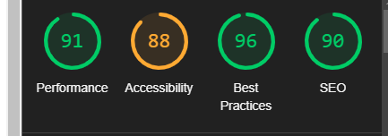
* 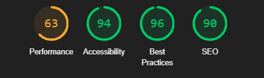

#### About 

* 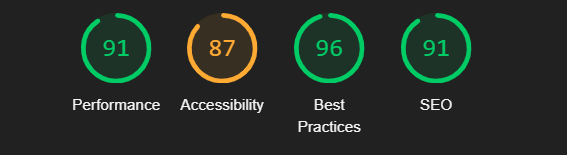
* 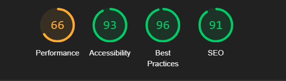

#### Profile

* 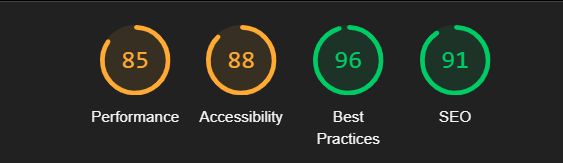
* 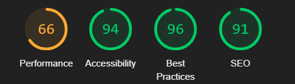

#### Profile Edit 

* 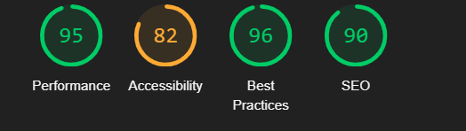
* 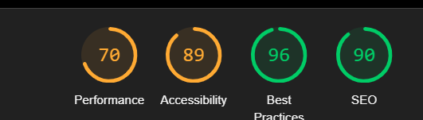

#### Products

* 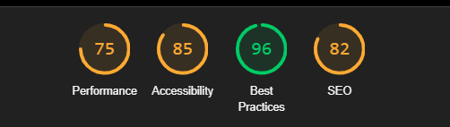
* 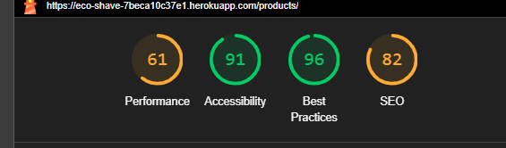

#### Add product 

* 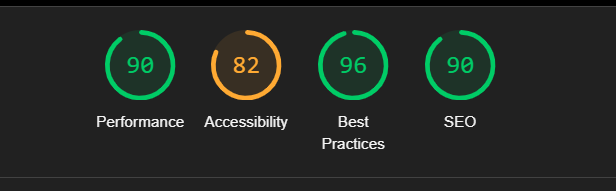
* 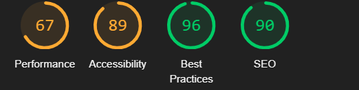

#### Edit product 

* 
* 

#### Product Detail

* 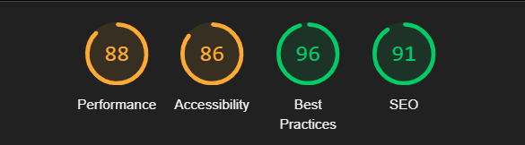
* 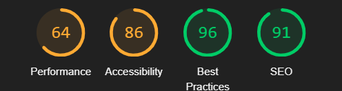

#### Wish List

* 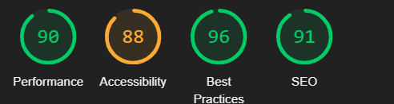
* 

#### FAQ

* 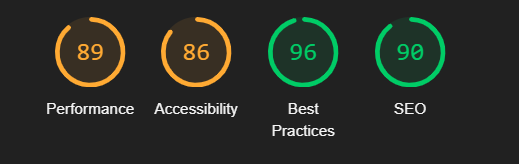
* 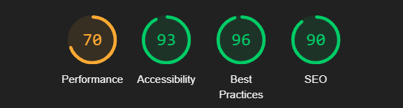

#### Contact Us

* 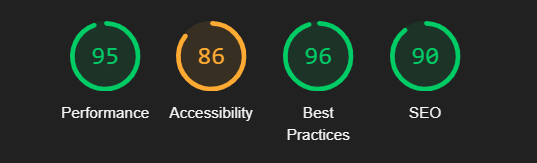
* 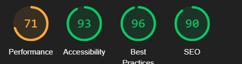

#### All Auth

* 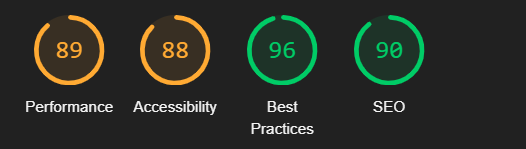
* 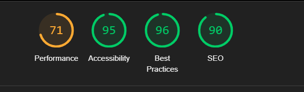

[Back to Table of Contents](#table-of-contents)

## HTML Validation

* I used the [W3C Validator](https://validator.w3.org/)
* They managed to clear the errors I found from the validator on all the links.

links validated success 

* [Profile](/static/readme/test-image/html-test/userprofilesuccess.png)
* [Profile Edit](/static/readme/test-image/html-test/profile_edit.png)
* [Delete Profile](/static/readme/test-image/html-test/deleteprofile.png)
* [Password Change](/static/readme/test-image/html-test/profilepasswordchange.png)
* [Password Reset](/static/readme/test-image/html-test/password-reset.png)
* [Home Page](/static/readme/test-image/html-test/homepage.png)
* [HTML About Page](/static/readme/test-image/html-test/aboutpagesuccess.png)

## CSS Validation

* MY custom CSS was validated using [W3C Jigsaw validation](https://jigsaw.w3.org/css-validator/)service. 

#### Leason learnt:

 I was eager to have differant css files as to me it is a nice feature to have, but this makes things more complex in the project when it comes to styling. I would be more carefull in the future when using differant css files in one project and a adopt a simpler approuch.
 In this project I had a free template that I tried to adjust, to the needs of the project.This became difficult with the added css files to troubleshooting and was more time consuming in the end to find solutions to the problems found.

 

CSS success image

##### Base CSS

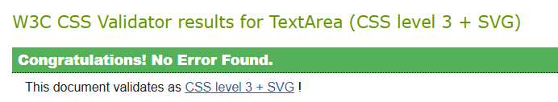

##### About CSS

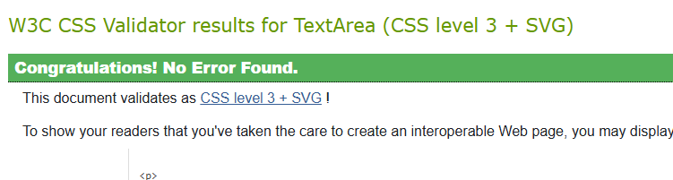

##### About Error Fixed

* I forgot to add the unit behond the digit eg: 1px 

##### Checkout CSS

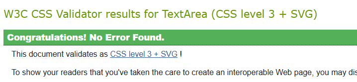

##### Profiles

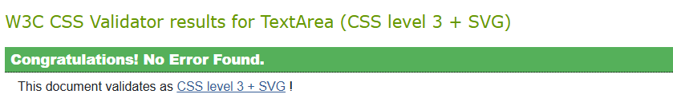

##### Error Fixed

* Here was some left over some code from the flip card Idea I had to simple remove this.
* I had a typo issue with one of the fields I added both auto and hidden

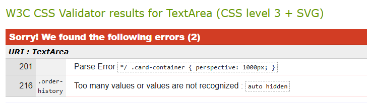

[Back to Table of Contents](#table-of-contents)

## Java Script 

* I used [jsHint](https://jshint.com/) for testing the JS in my static file 
* Removed all the warnings and errors.
* Undefinded variables and unused variables remained.
* I tried to remove these as well but ended up crashing my app features and decided to leave them as they are no risk. 

jsHInt error summary 

#### JS Errors

| Line | Error Message                                                           | Line | Error Message                                                           |
|------|-------------------------------------------------------------------------|------|-------------------------------------------------------------------------|
| 1    | 'const' is available in ES6 (use 'esversion: 6') or Mozilla JS extensions (use moz). | 2    | 'const' is available in ES6 (use 'esversion: 6') or Mozilla JS extensions (use moz). |
|
| Type | Variable |
|------|----------|
| Undefined | 7 bootstrap |

## Manual Testing

In addition to tests stated above I have performed a series of manual tests. Below the list of tests that has been conducted can be found.

Manual Testing results 

| Status | **Main Website - User Logged Out**
|:-------:|:--------|
| &check; | Typing in a incorrect URL on the page loads the 404 error page
| &check; | Pasting page that needs authentication loads the log in page
| &check; | Clicking the nav logo loads the home page
| &check; | Clicking the Home button on the nav bar loads the home page and lists all posts
| &check; | Clicking the About button on the nav bar loads the About page.
| &check; | Clicking While in the About page clicking on the contac us link loads the contact page.
| &check; | Clicking the Register link loads the Register page
| &check; | Clicking the Log In link loads the Log In page 
| &check; | Clicking In the Log In link clicking on the forget password link loads password reset.  
| &check; | Clicking on the Post title loads the review detail page
| &check; | In Post details view the user has no access to update post.
| &check; | In the details view the user cannot create a comment or delet.
| &check; | Clicking the Facebook link in the footer area opens Facebook link. 
| &check; | Clicking the X link in the footer area opens X link . 
| &check; | Clicking the You Tube in the footer area opens You Tube link.
| &check; | Clicking the search field and serching for Author,Body,Excerpt,Title works. 

| Status | **Main Website - User Logged In**
|:-------:|:--------|
| &check; | Typing in a incorrect URL on the page loads the 404 error page
| &check; | User cannot access Admin Panel without being staff member
| &check; | Clicking the nav logo loads the home page
| &check; | Clicking the Home button on the nav bar loads the home page and lists all posts
| &check; | Clicking the About button on the nav bar loads the About page.
| &check; | Clicking While in the About page clicking on the contac us link loads the contact page.
| &check; | Clicking in the Profile page loads the Profile page.
| &check; | While in the Profile page clicking on the button Password change loads the page to change password.
| &check; | While in the Profile page clicking on the button Profile Edit loads the page to edit profile.
| &check; | While in the Profile Edit page clicking on the button delete Profile Picture deletes profile picture.
| &check; | While in the Profile page clicking on the button Profile Delete loads confirm page and then when confirmed deletes profile.
| &check; | After it  deletes profile a success message is displayed or error message if not.
| &check; | In the detail post view or the home page will show buttons if user is the author of post.
| &check; | In the detail post view the logged in user can comment underneath a post.
| &check; | When user submits a comment a confirmation message is being shown on the page
| &check; | In the detail view the logged in user can update/delete the comments written by themselves.
| &check; | Clicking the update button the comment text will show in the comment box.
| &check; | Clicking the delete button loads the delete comment confirm message page.
| &check; | In the detail view the logged in user can Favorite/unfavorite posts.
| &check; | In the detail view the logged in user has full CRUD for the post written by themselves.
| &check; | Clicking the edit button in My Blog nav link view loads the edit btn and page.
| &check; | Clicking the delete button in the detail view loads the delete post confirmation page
| &check; | Clicking the My Blog nav link in the logged in user nav bar shows the logged in users posts
| &check; | While in the My Blog link the logged in user can see there drafts and published posts.
| &check; | In the logged in user menu the Admin Area is not visible
| &check; | Clicking the X link in the footer area opens X link . 
| &check; | Clicking the You Tube in the footer area opens You Tube link.
| &check; | Clicking the search field and serching for Author,Body,Excerpt,Title works. 

| Status | **Main Website - Admin Logged In**
|:-------:|:--------|
| &check; | The Admin Panel is access b typing /admin
| &check; | Deleting a Profile works on the Admin Panel
| &check; | Deleting a Post works on the Admin Panel
| &check; | Deleting a Comment works on the Admin Panel
| &check; | Changing an email of any user works in the admin bar
| &check; | Changing a password of any user works in the admin bar
| &check; | Deleting a Profile will delete their posts, comments and email and logout the user before delet.

 Status | **Create A Post - User Logged In**
|:-------:|:--------|
| &check; | Title field is required
| &check; | Title field does not accept empty field
| &check; | Title field does not accept just spaces
| &check; | Featured Image is not required
| &check; | Body field is required
| &check; | Body field does not accept empty field
| &check; | Body field has to have 100 characters.
| &check; | Excerpt is not required
| &check; | Excerpt auto summorises the text.
| &check; | Status field defaults to Draft
| &check; | Posting as shows name of author
| &check; | If no image is selected a default is provided.
| &check; | **Home** page with a success message is displayed when the user submits the post

Status | **Create A New User - User Logged Out**
|:-------:|:--------|
| &check; | Username field is required
| &check; | Username field does not accept empty field
| &check; | Email field does not accept just spaces
| &check; | Email field is optional
| &check; | Password field is required does not accept empty field
| &check; | Success message is displayed when the user creates a new user
| &check; | Error message with corresponding info when wrong input is submitted

Status | **Profile Page - User Logged In**
|:-------:|:--------|
| &check; | The default profile info is seen on the profile page (Field not provided).
| &check; | The profile success message or error is displayed when the user submits the profile form.
| &check; | A new user has CRUD on there profile and posts, like and crud on comment after registering.

### Responsiveness Test
The responsive design tests were carried out manually with [Google Chrome DevTools](https://developer.chrome.com/docs/devtools/) and [Multi Device Mockup Generator](https://techsini.com/multi-mockup/).

| Desktop    | Display <1200px       | Display >1200px    |
|------------|-----------------------|--------------------|
| Render     | pass                  | pass               |
| Images     | pass                  | pass               |
| Links      | pass                  | pass               |

| Tablet     | iPad Air              | Asus Zenbook Fold  | iPad Mini | iPad Pro |
|------------|-----------------------|--------------------|-----------|----------|
| Render     | pass                  | pass               | pass      | pass     |
| Images     | pass                  | pass               | pass      | pass     |
| Links      | pass                  | pass               | pass      | pass     |

| Phone      | Galaxy S8+/S20 Ultra  | iPhone XR/12Pro/14 Pro Max | Pixel 7 / 7 Pro      |
|------------|-----------------------|----------------------------|----------------------|
| Render     | pass                  | pass                       | pass      | pass     |
| Images     | pass                  | pass                       | pass      | pass     |
| Links      | pass                  | pass                       | pass      | pass     |

### Browser Compatibility
* Google Chrome Version 
* Mozilla Firefox 
* Microsoft Edge 

 
[Back to Table of Contents](#table-of-contents)

- All manual testing was done with DEBUG = False in the settings.py file.

* **All known bugs have been fixed**

## Fixed bugs

* I had quite a few bugs during this project some of them I have manged to document.
* There are probibly more bugs I fixed but can not remmeber as during troubleshooting I often forgot to document the process.

| **Bug**                                                                 | **Fix**                                                                                                          |
|-------------------------------------------------------------------------|-----------------------------------------------------------------------------------------------------------------|
| Bug1: Heroku log = Mis-cased Procfile detected; ignoring. to Heroku    | Rename it to `Procfile` to have it honored as it is case sensitive.                                            |

[Back to Table of Contents](#table-of-contents)

## Unfixed Bugs 

* I do not know of any other unfixed bugs .

| Bug                     | Status      | Why                                                                 |
|------------------------|-------------|---------------------------------------------------------------------|
| CSRF verification failed | Unfixed     | This is a known problem that happens intermitendly on login ; all resources, including tutor support, acknowledge that this is a known Django issue. |
