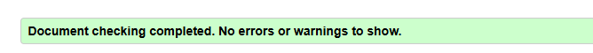
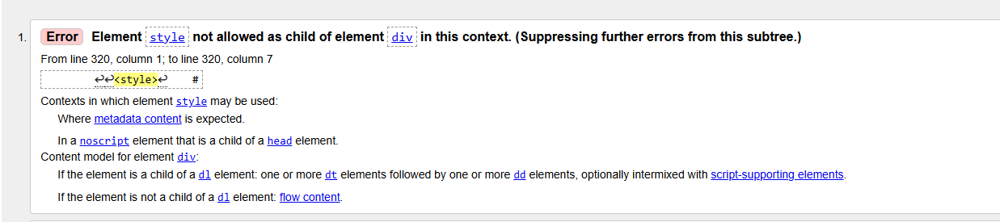
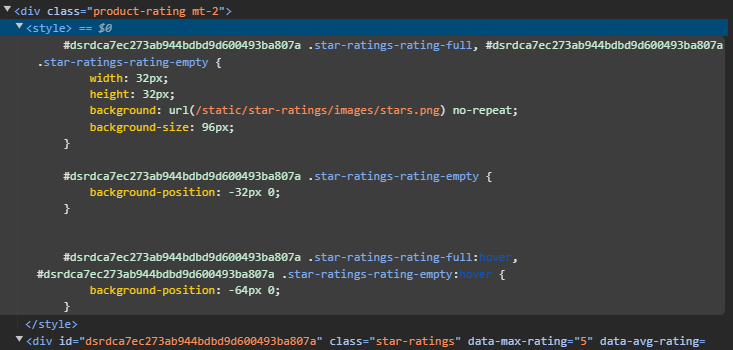
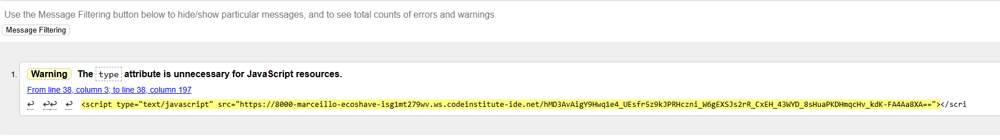
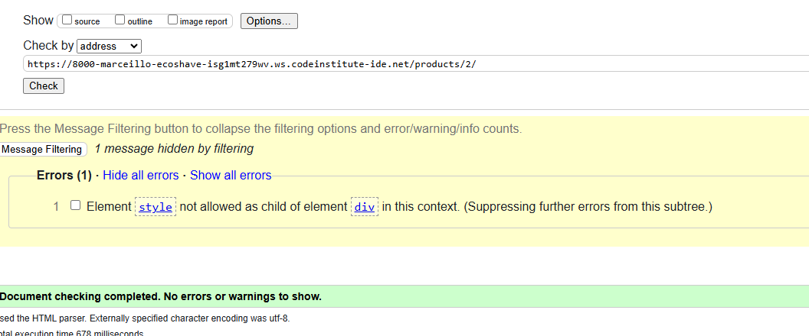
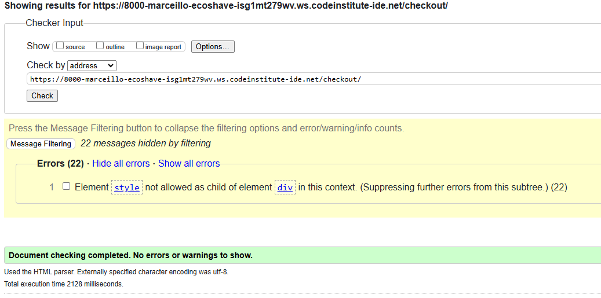
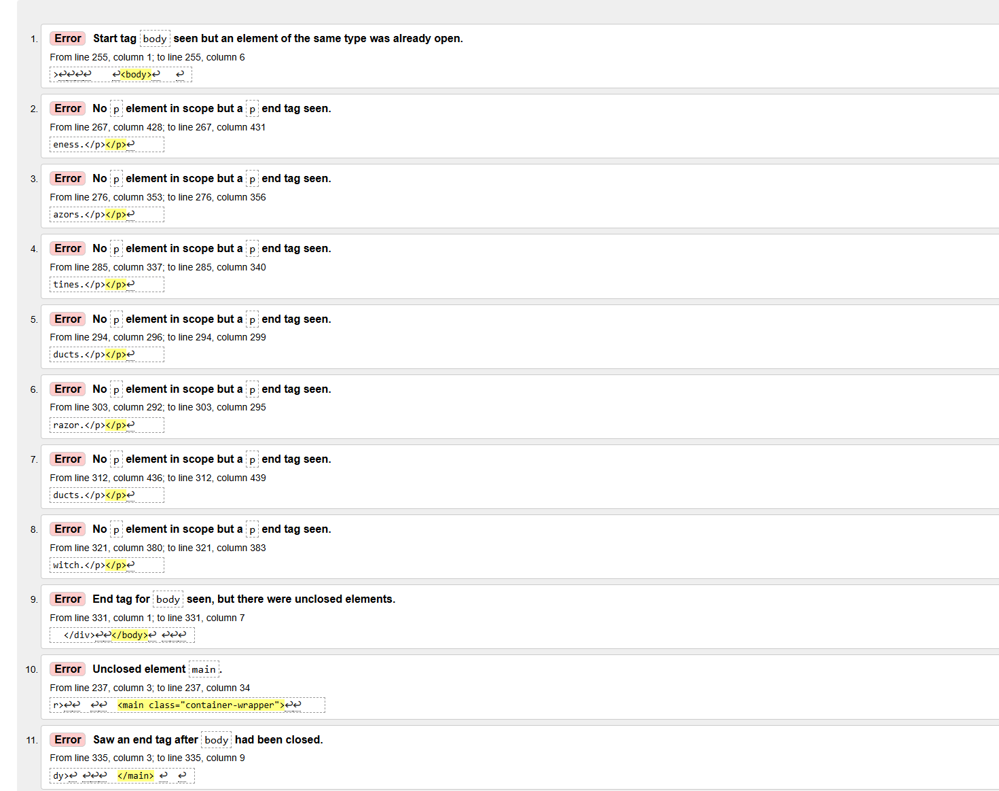
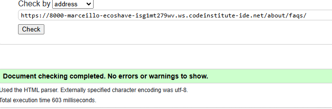
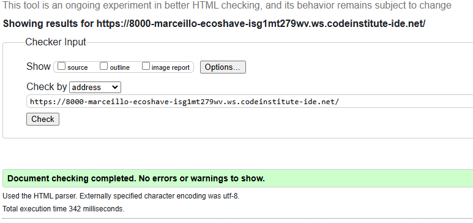
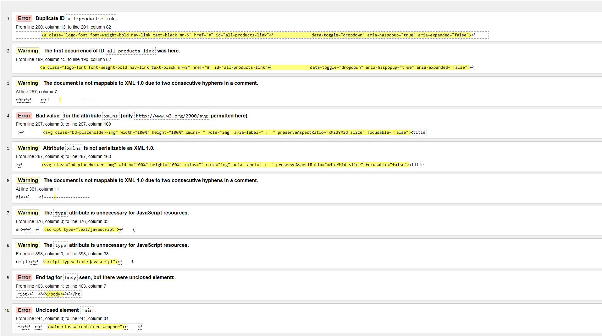

# Table of Contents

- [Testing](#testing)
- [Testing User Stories](#testing-user-stories)
- [Responsive Layout and Design](#responsive-layout-and-design)
- [Python Validation](#python-validation)
- - [PeP8 Errors Fixed](#pep8-errors-fixed)
- [Lighthouse](#lighthouse)
- [HTML Validation](#html-validation)  
- [CSS Validation](#css-validation) 
- [Manual Testing](#manual-testing)
- [Fixed Bugs](#fixed-bugs)
- [Unfixed Bugs](#unfixed-bugs)
- [Back to Readme](README.md)
 
 

# Testing

 

## Testing User Stories

User stories testing table

| EPIC                                 | ID   | User Story                                                                 | Check | Test Result                                                                                      |
| :----------------------------------- | ---- | :------------------------------------------------------------------------- | :---: | :----------------------------------------------------------------------------------------------- |
| **E-commerce Integration** |      |                                                                           |       |                                                                                                 |
|                                     | 1.1  | As a user, I want to add products to a shopping cart and proceed to check out, so I can easily make purchases on the site. | [x]   | Products can be added, viewed, removed, and adjusted in quantity.                             |
|                                     | 1.2  | As a user, I want to receive confirmation of my purchase via email and on-screen notifications to verify my order. | [x]   | Users receive an email confirmation after a successful purchase.                               |
|                                     | 1.3  | As a user, I want a streamlined checkout process so that I can complete my purchases efficiently.  | [x]   | Users can review their orders and enter payment details easily.                                 |
|                                     | 1.4  | As a user, I want to see order confirmation details clearly after purchase, so I can have a record of my transaction.  | [x]   | Order confirmation details are displayed on the screen immediately after purchase.              |
| **User Experience Design** |      |                                                                           |       |                                                                                                 |
|                                     | 2.1  | As a user, I want an accessible and intuitive website, so I can navigate and interact with the content seamlessly. | [x]  | The front end meets WCAG accessibility guidelines.                                             |
|                                     | 2.2  | As a user, I want a mobile-responsive design, so I can access the website on different devices.                       | [x]   | The website layout adapts to various screen sizes (desktop, tablet, mobile).                   |
|                                     | 2.3  | As a user, I want to edit and view my profile information, so I can keep my account details up-to-date.              | [x]   | Users can access and modify their profile information easily.                                   |
|                                     | 2.4  | As a user, I want to create and manage a wishlist within my profile modal, so I can save products for future consideration.| [x]   | Users can add products to their wishlist from product pages; the wishlist is accessible from the user profile modal. |
|                                     | 2.5  | As a user, I want to rate products after purchase, so I can share my feedback with others.                            | [x]   | A product rating feature is implemented allowing users to submit ratings easily.                |
|                                     | 2.6  | As a user, I want to view multiple images of products, so I can make informed purchasing decisions.| [x]   | Multi-view functionality for product images is available on product pages.                     |
| **Search Engine Optimization** |      |                                                                           |       |                                                                                                 |
|                                     | 3.1  | As a user, I want to find products quickly using search functionality, so I can locate items efficiently.             | [x]   | Each page includes Meta Description tags and a sitemap; a search bar is available for accurate results. |
|                                     | 3.2  | As a user, I want a helpful 404 error page with navigation options, so I can find my way back to the main site if needed.| [x]   | A 404 error page includes links to the homepage and contact page.                              |
| **Authentication and Authorization**|      |                                                                           |       |                                                                                                 |
|                                     | 4.1  | As a user, I want to register and log in securely to access my account information.| [x]   | A secure authentication system is implemented for registration and login.                      |
|                                     | 4.2  | As an admin, I want to manage user roles effectively, so I can control access levels based on user roles.| [x]   | Role-based access control is implemented with restricted access for non-admin users.          |
|                                     | 4.3  | As a user, I want to see my login status clearly on every page.| [x]   | A visual indicator of the current login state is displayed prominently.                        |
|                                     | 4.4  | As an admin, I want to manage roles for users effectively so that permissions are appropriately assigned based on their roles.| [x]   | Role management features are implemented in the admin panel allowing admins to assign roles easily.               |
| **Marketing and Brand Reach** |      |                                                                           |       |                                                                                                 |
|                                     | 5.1  | As a user, I want to subscribe to newsletters for updates and promotions.| [x]   | A newsletter signup form is available.         |
|                                     | 5.2  | As a user, I want to share products on social media easily to recommend them to friends.| [x]   | Social media sharing buttons are available on product pages.                                   |
| **E-commerce Fundamentals** |      |                                                                           |       |                                                                                                 |
|                                     | 6.1  | As a business owner, I want to document the e-commerce model clearly to outline the application’s purpose and user value.| [x]   | A detailed marketing plan is included in the README file explaining the e-commerce model and target audience. |
|                                                          |
| **Customer Support and Information Access**|      |                                                                           |       |                                                                                                 |
|                                     | 7.1  | As a user, I want to submit a contact form so that I can easily reach out for support or inquiries.| [x]   | A contact form is available on the About Page; it includes fields for name, email, subject, and message; form validation ensures that all required fields are completed before submission; users receive a confirmation message upon successful submission. |
|                                     | 7.2  | As a user, I want to view frequently asked questions in a modal so that I can find quick answers .| [x]   | A button or link to open the FAQ modal is prominently displayed in the nav bar.; the modal contains common questions with expandable answers; users can close the modal easily. |
|                                     
|                                     | 7.3  | As a user, I want a confirmation message on my contact form submissions so that I'm aware of any responses or actions taken.| [x]   | Confirmation messages are shown on submission.   |

 

## Responsive Layout and Design

The project design was adapted to different devices and Bootstrap helped with most of this. My focus was really to have a working Django APP. As I have said before, time was an issue for me to really do a design with all the bells and whistles this will be my future focus for this project.

* Testing was ongoing during this project from one feature to the next even so I left some of the final testing for last.
 
### Responsiveness Test
The responsive design tests were carried out manually with [Google Chrome DevTools](https://developer.chrome.com/docs/devtools/) and [Multi Device Mockup Generator](https://techsini.com/multi-mockup/).

| Desktop    | Display <1200px       | Display >1200px    |
|------------|-----------------------|--------------------|
| Render     | pass                  | pass               |
| Images     | pass                  | pass               |
| Links      | pass                  | pass               |

| Tablet     | iPad Air              | Asus Zenbook Fold  | iPad Mini | iPad Pro |
|------------|-----------------------|--------------------|-----------|----------|
| Render     | pass                  | pass               | pass      | pass     |
| Images     | pass                  | pass               | pass      | pass     |
| Links      | pass                  | pass               | pass      | pass     |

| Phone      | Galaxy S8+/S20 Ultra  | iPhone XR/12Pro/14 Pro Max | Pixel 7 / 7 Pro      |
|------------|-----------------------|----------------------------|----------------------|
| Render     | pass                  | pass                       | pass      | pass     |
| Images     | pass                  | pass                       | pass      | pass     |
| Links      | pass                  | pass                       | pass      | pass     |

### Browser Compatibility
* Google Chrome Version 
* Mozilla Firefox 
* Microsoft Edge 

## Python Validation

* I had a lot of errors found but none that could not be fixed, use this tool [pep8ci](https://pep8ci.herokuapp.com/)
* Cleared all until I received this Results: All clear, no errors found

## PeP8 Errors Fixed

 PeP8 errors/warnings fixed

| **File** | **Warning/Error** |
|-------------------------|----------------------------------------------------------------------------------|
| `env.py` | E501 line too long (153 > 79 characters)                                          |
|                         | E501 line too long (80 > 79 characters)                                           |
|                         | E501 line too long (143 > 79 characters)                                          |
|                         | E501 line too long (143 > 79 characters)                                          |
|                         | W291 trailing whitespace                                                          |
| `profiles-views.py` | E271 multiple spaces after keyword                                               |
|                         | E302 expected 2 blank lines, found 1                                              |
|                         | W293 blank line contains whitespace                                              |
|                         | E303 too many blank lines (2)                                                     |
|                         | W291 trailing whitespace                                                          |
|                         | W293 blank line contains whitespace                                              |
|                         | W293 blank line contains whitespace                                              |
|                         | E302 expected 2 blank lines, found 1                                              |
|                         | W291 trailing whitespace                                                          |
|                         | W293 blank line contains whitespace                                              |
|                         | E501 line too long (80 > 79 characters)                                           |
|                         | W391 blank line at end of file                                                   |
| `profile-urls.py` | E231 missing whitespace after ','                                                 |
|                         | E501 line too long (84 > 79 characters)                                           |
|                         | E501 line too long (90 > 79 characters)                                           |
|                         | E501 line too long (103 > 79 characters)                                          |
|                         | W292 no newline at end of file                                                   |
| `profile-models.py` | E501 line too long (89 > 79 characters)                                           |
|                         | E501 line too long (81 > 79 characters)                                           |
|                         | E501 line too long (84 > 79 characters)                                           |
|                         | E501 line too long (84 > 79 characters)                                           |
|                         | E501 line too long (81 > 79 characters)                                           |
|                         | E501 line too long (80 > 79 characters)                                           |
|                         | W293 blank line contains whitespace                                              |
|                         | W293 blank line contains whitespace                                              |
|                         | W391 blank line at end of file                                                   |
| `profile-forms.py` | W291 trailing whitespace                                                          |
|                         | W291 trailing whitespace                                                          |
|                         | E231 missing whitespace after ','                                                 |
|                         | W291 trailing whitespace                                                          |
|                         | W293 blank line contains whitespace                                              |
|                         | W291 trailing whitespace                                                          |
|                         | E501 line too long (102 > 79 characters)                                          |
|                         | W291 trailing whitespace                                                          |
|                         | W292 no newline at end of file                                                   |
| `products-widgets.py` | E501 line too long (87 > 79 characters)                                           |
|                         | W293 blank line contains whitespace                                              |
| `products-views.py` | E302 expected 2 blank lines, found 1                                              |
|                         | E501 line too long (93 > 79 characters)                                           |
|                         | E501 line too long (94 > 79 characters)                                           |
|                         | W293 blank line contains whitespace                                              |
|                         | E303 too many blank lines (2)                                                     |
|                         | W293 blank line contains whitespace                                              |
|                         | W293 blank line contains whitespace                                              |
|                         | E303 too many blank lines (2)                                                     |
|                         | W293 blank line contains whitespace                                              |
|                         | W293 blank line contains whitespace                                              |
|                         | E501 line too long (82 > 79 characters)                                           |
|                         | E501 line too long (97 > 79 characters)                                           |
|                         | W293 blank line contains whitespace                                              |
|                         | E501 line too long (88 > 79 characters)                                           |
|                         | W292 no newline at end of file                                                   |
| `products-urls.py` | W291 trailing whitespace                                                          |
|                         | E501 line too long (82 > 79 characters)                                           |
|                         | E501 line too long (82 > 79 characters)                                           |
|                         | W293 blank line contains whitespace                                              |
|                         | W292 no newline at end of file                                                   |
| `products-models.py` | E128 continuation line under-indented for visual indent                           |
|                         | W293 blank line contains whitespace                                              |
|                         | E302 expected 2 blank lines, found 1                                              |
|                         | W293 blank line contains whitespace                                              |
|                         | W291 trailing whitespace                                                          |
|                         | W291 trailing whitespace                                                          |
|                         | E302 expected 2 blank lines, found 1                                              |
|                         | W292 no newline at end of file                                                   |
| `products-forms.py` | E302 expected 2 blank lines, found 1                                              |
|                         | W293 blank line contains whitespace                                              |
|                         | E301 expected 1 blank line, found 0                                               |
|                         | W293 blank line contains whitespace                                              |
|                         | W391 blank line at end of file                                                   |
| `products-admin.py` | E302 expected 2 blank lines, found 1                                              |
|                         | E124 closing bracket does not match visual indentation                           |
|                         | W293 blank line contains whitespace                                              |
|                         | W291 trailing whitespace                                                          |
|                         | W292 no newline at end of file                                                   |
| `products-migrations.py`| E501 line too long (117 > 79 characters)                                          |
|                         | W293 blank line contains whitespace                                              |
|                         | E501 line too long (115 > 79 characters)                                          |
|                         | E501 line too long (117 > 79 characters)                                          |
|                         | E501 line too long (85 > 79 characters)                                           |
|                         | W391 blank line at end of file                                                   |
| `home-views.py` | E302 expected 2 blank lines, found 1                                              |
| `home-urls.py` | W291 trailing whitespace                                                          |
|                         | W292 no newline at end of file                                                   |
| `eco-shave-urls.py` | E225 missing whitespace around operator                                          |
|                         | W292 no newline at end of file                                                   |
| `eco-shave-settings.py` | E303 too many blank lines (3)                                                     |
|                         | E291 trailing whitespace                                                          |
|                         | E501 line too long (91 > 79 characters)                                          |
|                         | W291 trailing whitespace                                                          |
|                         | W293 blank line contains whitespace                                              |
|                         | W291 trailing whitespace                                                          |
|                         | W292 no newline at end of file                                                   |
| `checkout-webhooks.py` | E302 expected 2 blank lines, found 1                                              |
|                         | E122 continuation line missing indentation or outdented                           |
|                         | W293 blank line contains whitespace                                              |
|                         | E501 line too long (86 > 79 characters)                                          |
| `checkout-views.py` | E501 line too long (87 > 79 characters)                                          |
|                         | W291 trailing whitespace                                                          |
|                         | E302 expected 2 blank lines, found 1                                              |
|                         | W293 blank line contains whitespace                                              |
|                         | W293 blank line contains whitespace                                              |
| `checkout-signals.py` | E302 expected 2 blank lines, found 1                                              |
|                         | W293 blank line contains whitespace                                              |
|                         | W292 no newline at end of file                                                   |
| `checkout-models.py` | E502 line too long (99 > 79 characters)                                          |
|                         | W293 blank line contains whitespace                                              |
| `checkout-forms.py` | W292 no newline at end of file                                                   |
|                         | W291 trailing whitespace                                                          |
| `bag-views.py` | E501 line too long (87 > 79 characters)                                          |
|                         | W291 trailing whitespace                                                          |
|                         | E302 expected 2 blank lines, found 1                                              |
| `bag-urls.py` | E501 line too long (81 > 79 characters)                                          |
|                         | W293 blank line contains whitespace                                              |
| `bag-contents.py` | E302 expected 2 blank lines, found 1                                              |
|                         | E391 blank line at end of file                                                   |
| `about-views.py` | E302 expected 2 blank lines, found 1                                              |
|                         | W293 blank line contains whitespace                                              |
|                         | W292 no newline at end of file                                                   |
|                         | W293 blank line contains whitespace                                              |
| `about-urls.py` | E501 line too long (84 > 79 characters)                                          |
|                         | W292 no newline at end of file                                                   |
| `about-models.py` | W291 trailing whitespace                                                          |
|                         | W293 blank line contains whitespace                                              |
|                         | E292 no newline at end of file                                                   |

                                      

 

## Lighthouse
 

* I had some performance scores that I received were above the 60% mark one reason was the image files for pages with images.
* Mostly good scores they could always be better when I come back to this project and will improve these scores in the future. 
 

Lighthouse test images

* I added some of them but not all as the results were all similar.

#### Home

* 
* 

#### About 

* 
* 

#### Profile

* 
* 

#### Profile Edit 

* 
* 

#### Products

* 
* 

#### Add product 

* 
* 

#### Edit product 

* 
* 

#### Product Detail

* 
* 

#### Wish List

* 
* 

#### FAQ

* 
* 

#### Contact Us

* 
* 

#### All Auth

* 
* 

[Back to Table of Contents](#table-of-contents)

## HTML Validation

* I used the [W3C Validator](https://validator.w3.org/)
* They managed to clear most of the template errors and received the below success message.
 

HTML Validated Summary 

## Validation Errors Could not fix

##### Star Rating validation error 
* I could not clear this below error message. This was software that I installed from Django star-rating.
 At the time I thought it was great I had problems installing and setting up but got it to work.
 This problem with the validation I did not expect as the library automatically injects this style element into it. I tried many things to see if I could fix it I tried creating a custom widget and forcing it that way but to no avail. I tried using the dango tags to see if that forces it into the head element that also did not work. In all, I spent a lot of time troubleshooting this. I searched online and found a [ticket](https://github.com/wildfish/django-star-ratings/issues/198) that has been open since 2020. This is unfortunate but sometimes the code or software we use causes problems like the summernote application also causes validation errors. 
  * This affected the apps with the star rating I cleared out the errors of my code.
  * - The style error was hidden here to show the success message  

 

##### Star rating element from inspect tools.

##### The Stripe validation warning

* I had a warning message that I could find in my code only to discover that the stripe code is doing this.
Since I can not change this it is a warning that does not affect anything.

 ##### Products 

 
  
 ##### Product Detail

 

 ##### Checkout Detail

 

 

### Errors found and cleared in the below apps 

##### Faq errors 

 

##### Faq cleared the error 

##### Home Success

 

##### Home Error

| **App Validation** | **Success** |
|--------------------------------|--------------|
| Contact Us                     | [x]          |
| Contact Us Confirmation        | [x]           |
| Wish List                      | [x]           |
| About                          | [x]           |
| Add Product                    | [x]           |
| Edit Product                   | [x]           |
| Delete Product                 | [x]           |
| FAQ                            | [x]           |
| Add FAQ                        | [x]           |
| Edit FAQ                       | [x]           |
| Delete FAQ                     | [x]           |
| Profile                        | [x]           |
| Bag                            | [x]           |
| Checkout                       | [x]           |

## CSS Validation

* MY custom CSS was validated using [W3C Jigsaw validation](https://jigsaw.w3.org/css-validator/)service. 

#### Leason learnt:

 I was eager to have different CSS files as to me it is a nice feature to have, but this makes things more complex in the project when it comes to styling. I would be more careful in the future when using different CSS files in one project and adopt a simpler approach.
 In this project, I had a free template that I tried to adjust, to the needs of the project. This became difficult with the added CSS files to troubleshooting and was more time-consuming in the end to find solutions to the problems found.

 

CSS success image

##### Base CSS

##### About CSS

##### About Error Fixed

* I forgot to add the unit beyond the digit eg: 1px 

##### Checkout CSS

##### Profiles

##### Error Fixed Profiles

* Here was some leftover code from the flip card Idea I had to simply remove this.
* I had a typo issue with one of the fields I added both auto and hidden

[Back to Table of Contents](#table-of-contents)

## Java Script 

* I used [jsHint](https://jshint.com/) for testing the JS in my static file 
*Did not have errors just some warnings that are not harmful.
* Undefined variables and unused variables remained.
* I tried to remove these as well but ended up crashing my app features and decided to leave them as they are no risk. 

jsHInt error summary 

#### JS Errors

| File Name                        | Metrics Summary                                                                 | Errors | Warning Summary                                             | Undefined Variables       |
|----------------------------------|--------------------------------------------------------------------------------|--------|-------------------------------------------------------------|---------------------------|
| profiles-js-Countryfields.js     | There is only one function in this file. It takes no arguments. This function contains 4 statements. Cyclomatic complexity number for this function is 2. | 0      | 'let' is available in ES6 (use 'esversion: 6')             | $                         |
| Base template                     | There is only one function in this file. It takes one argument. This function contains 16 statements. Cyclomatic complexity number for this function is 1. | 0      | Array literal notation [] is preferable                     | fnames, ftypes, jQuery    |
| Stripe checkout                   | There are 5 functions in this file. The function with the largest signature takes 1 argument, while the median is 1. The largest function has 10 statements in it, while the median is 5. The most complex function has a cyclomatic complexity value of 3 while the median is 1. | 0      | 'template literal syntax' is only available in ES6 (use 'esversion: 6')   | $, Stripe                 |
| Wishlist                          | There are 6 functions in this file. The function with the largest signature takes 1 argument, while the median is 1. The largest function has 6 statements in it, while the median is 2.5. The most complex function has a cyclomatic complexity value of 1 while the median is 1. | 0      | 'template literal syntax' is only available in ES6 (use 'esversion: 6')   | $                         |
| products                          | There are 2 functions in this file. The function with the largest signature takes 1 argument, while the median is 0.5. The largest function has 6 statements in it, while the median is 3.5. The most complex function has a cyclomatic complexity value of 2 while the median is 1.5. | 0      |                                                             | $                         |
| Products Detail                   | There are 6 functions in this file. The function with the largest signature takes 1 argument, while the median is 1. The largest function has 6 statements in it, while the median is 2.5. The most complex function has a cyclomatic complexity value of 1 while the median is 1. | 0      | 'template literal syntax' is only available in ES6 (use 'esversion: 6')   | $                         |
| edit product                      | There is only one function in this file. It takes no arguments. This function contains 2 statements. Cyclomatic complexity number for this function is 1. | 0      | 'template literal syntax' is only available in ES6 (use 'esversion: 6')   | $                         |
| add product                       | There is only one function in this file. It takes no arguments. This function contains 2 statements. Cyclomatic complexity number for this function is 1. | 0      | 'template literal syntax' is only available in ES6 (use 'esversion: 6')   | $                         |
| Quantity input script products    | There are 4 functions in this file. The function with the largest signature takes 1 argument, while the median is 1. The largest function has 6 statements in it, while the median is 5.5. The most complex function has a cyclomatic complexity value of 1 while the median is 1. | 0      | 'template literal syntax' is only available in ES6 (use 'esversion: 6')   | $                         |
| bag                               | There are 3 functions in this file. The function with the largest signature takes 1 argument, while the median is 1. The largest function has 6 statements in it, while the median is 2. The most complex function has a cyclomatic complexity value of 1 while the median is 1.|0       | 'template literal syntax' is only available in ES6 (use 'esversion: 6')   | $                         |
| FAQ                               | There is only one function in this file. It takes no arguments. This function contains 5 statements. Cyclomatic complexity number for this function is 2.|0       |                                                             |                           |

## Manual Testing

In addition to the tests stated above I have performed a series of manual tests. Below the list of tests that have been conducted can be found.

Manual Testing results 

| Status | **Main Website - User Logged Out**
|:-------:|:--------|
| &check; | Typing in an incorrect URL on the page loads the 404 error page
| &check; | Pasting page that needs authentication loads the login page
| &check; | Clicking the nav logo loads the home page
| &check; | Clicking the Home button on the nav bar loads the home page.
| &check; | Clicking the About button on the nav bar loads the About page.
| &check; | Clicking While on the About page clicking on the Contact Us link loads the contact page.
| &check; | Clicking the Register link loads the Register page
| &check; | Clicking the login link loads the login page 
| &check; | Clicking In the Log In link and clicking on the forget password link loads password reset.  
| &check; | Clicking on the Product loads the product detail page
| &check; | In the Product detail view the no-admin user has no access to update the product.
| &check; | In the details view the user cannot update or delete the product.
| &check; | Clicking the Facebook link in the footer area opens the Facebook link. 
| &check; | Clicking the newsletter opens the subscription form. 
| &check; | Adding the new e-mail in the newsletter generates a confirmation success.
| &check; | Clicking the search field and searching for a product works. 

| Status | **Main Website - User Logged In**
|:-------:|:--------|
| &check; | Typing in an incorrect URL on the page loads the 404 error page
| &check; | User cannot access Admin Panel without being a staff member
| &check; | Clicking the nav logo loads the home page
| &check; | Verify that the search results display correctly for valid queries. And invalid results |
| &check; | Ensure that clicking on a category in the navigation loads the relevant products.|
| &check; | Clicking the Home button on the nav bar loads the home page and shows all the links.
| &check; | While on the home page click on all the dropdown lists works.
| &check; | While on the home page the Faq, about, contact us is visible.
| &check; | Clicking the price opens the products page from high-low price.
| &check; | Clicking the all products loads all the products on one page.
| &check; | While in the Product testing, all the sorting functions work.
| &check; | Clicking on the categories loads each category's products and works.
| &check; | Clicking the About button on the nav bar loads the About page.
| &check; | Clicking While on the About page clicking on the Contact Us link loads the contact page.
| &check; | Clicking on the Profile page loads the Profile page.
| &check; | While on the Profile page clicking on edit Profile loaded the edit profile page.
| &check; | While in the Profile edit page updating a testing the fields works.
| &check; | While on the Profile edit page clicking on update works and diverts to the profile page.
| &check; | While on the Profile edit page clicking on the cancel button works and diverts to the profile page.
| &check; | While on the Profile page clicking on the wish list button loads the wish list page.
| &check; | While on the Wish list page clicking and testing all three buttons work.
| &check; | Ensure that users can add products to the wish list through the product detail page.
| &check; | The FAQ has CRUD for Admin users and there are success messages while updating. 
| &check; | The products can be added to the bag and it can be checked out.
| &check; | The product's quantity can be updated in the bag before checkout.
| &check; | While in the checkout when the form is filled and submitted it reflects in the admin panel and stripe. 

| Status | **Main Website - Admin Logged In**
|:-------:|:--------|
| &check; | The Admin Panel is accessed by typing /admin
| &check; | Deleting a Profile works on the Admin Panel
| &check; | Test to see if the admin can update and delete data.  
| &check; | Changing an email of any user works in the admin bar
| &check; | Changing the password of any user works in the admin bar

Status | **Create A New User - User Logged Out**
|:-------:|:--------|
| &check; | Username field is required
| &check; | Username field does not accept empty field
| &check; | Email field does not accept just spaces
| &check; | Password field is required does not accept empty field
| &check; | Success message is displayed when the user creates a new user
| &check; | A Verification email message is sent when the user creates a new user
| &check; | Error message with corresponding info when wrong input is submitted

Status | **Profile Page - User Logged In**
|:-------:|:--------|
| &check; | The default profile info is seen on the profile page (Field not provided).
| &check; | The Order history is displayed and there are the edit and wishlist buttons.
| &check; | The profile success message or error is displayed when the user submits the profile form.

- All manual testing was done with DEBUG = False in the settings.py file.

* **All known bugs have been fixed**

## Fixed bugs

* I had quite a few bugs during this project some of which I have managed to document.
* There are more bugs I fixed but can not remember as during troubleshooting I often forgot to document the process.

| **Error**                                | **Description**                                                                 | **Fix**                                                                                       |
|------------------------------------------|---------------------------------------------------------------------------------|-----------------------------------------------------------------------------------------------|
| CSRF Trusted Origins Error               | Values in `CSRF_TRUSTED_ORIGINS` must start with a scheme (e.g., `http://` or `https://`). | Added `https://` at the beginning of each value in `CSRF_TRUSTED_ORIGINS`.                    |
| `TemplateDoesNotExist`                   | `base.html` not found in the project.                                           | Updated `TEMPLATES['DIRS']` in `settings.py` to include correct paths to the templates folder.|
| `ModuleNotFoundError`                    | No module named `star_ratings.fields`.                                          | Verified and reinstalled `django-star-ratings` package.                                       |
| Template Syntax Error (Parsing Issue)    | Error parsing `product_dict[item_id]` in template.                              | Corrected syntax to ``.                                |
| Template Syntax Error (Block Tags)       | `endfor` used instead of `endwith` in template block tag.                       | Replaced `endfor` with `endwith` in the template.                                             |
| Template Syntax Error (Expected Tags)    | Missing `endfor` block tag in the template.                                     | Added the required `endfor` block tag.                                                       |
| `UnboundLocalError`                      | `product` variable not associated with a value in the view.                     | Fixed redundant code and corrected spelling mistakes in the view function.                   |
| Remove Function Not Working              | `remove_from_bag` function failed due to inconsistent string handling for keys. | Ensured all keys are consistently converted to strings using `str(item_id)`.                 |
| `NoReverseMatch` Error                   | Reverse URL for `adjust_bag` failed due to empty arguments.                     | Passed correct arguments to the reverse URL function.                                         |
| Template Does Not Exist (`field.html`)   | `bootstrap4/field.html` template missing during checkout.                       | Verified and reinstalled `django-crispy-forms` with Bootstrap 4 configuration.               |
                       |

[Back to Table of Contents](#table-of-contents)

## Unfixed Bugs 

* I do not know of any other unfixed bugs.

| Bug                     | Status      | Why                                                                 |
|------------------------|-------------|---------------------------------------------------------------------|
| CSRF verification failed | Unfixed     | This is a known problem that happens intermittently on login; all resources, including tutor support, acknowledge that this is a known Django issue. |
